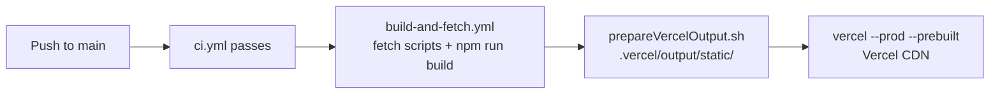

# Deployment

[← Hub](https://keglev.github.io/my-portfolio/index.html) · [← Docs index](docs-index.html)

This project deploys the React app to Vercel (live site). At build time, `scripts/fetchProjects.js` fetches GitHub data and writes static artifacts to `public/` before the React build starts. The generated API docs are published separately to GitHub Pages via the `gh-pages` branch.

## Contents

- [Deployment targets](#deployment-targets)
- [Environment variables](#environment-variables)
- [Deploying to Vercel](#deploying-to-vercel)
- [Running locally](#running-locally)
- [Build artifacts](#build-artifacts)
- [Security](#security)
- [Troubleshooting](#troubleshooting)
- [References](#references)

## Deployment targets

| Target | URL | Trigger | Branch |
|--------|-----|---------|--------|
| Vercel (live site) | `carloskeglevich.vercel.app` | Push to main | main |
| GitHub Pages (API docs) | https://keglev.github.io/my-portfolio/ | Workflow dispatch | gh-pages |

## Environment variables

Set these in the Vercel dashboard under **Project → Settings → Environment Variables**, targeting the **Build** step for both **Production** and **Preview** environments.

| Variable | Required | Description |
|----------|----------|-------------|
| `GH_PROJECTS_TOKEN` | Yes | GitHub PAT. Use `public_repo` scope for public repos, `repo` for private |
| `DEEPL_API_KEY` or `DEEPL_SECRET` | No | If either is set, translates project summaries to German via DeepL. Both variable names are accepted by the fetch script. |
| `DEBUG_FETCH` | No | Set to `1` to emit extra debug logs. Disable in production |

## Deploying to Vercel

Deployment runs through GitHub Actions using a prebuilt artifact. Vercel does not run the build itself — GitHub Actions builds the app and hands Vercel a ready-to-serve `.vercel/output/` directory.

A `vercel.json` in the project root configures two fields: `github.productionBranch: "main"` anchors any Vercel GitHub integration to the `main` branch (preventing the `gh-pages` documentation branch from being treated as a production source), and `buildCommand: "react-scripts build"` records the correct build command. The `buildCommand` is never invoked in practice because `vercel --prod --prebuilt` delivers a finished artifact and Vercel performs no build step.

1. Connect the GitHub repository to a Vercel project and record `VERCEL_TOKEN`, `VERCEL_ORG_ID`, and `VERCEL_PROJECT_ID` as GitHub Actions secrets (first-time setup only).
2. Set `GH_PROJECTS_TOKEN` as a GitHub Actions secret.
3. Optionally set `DEEPL_API_KEY` or `DEEPL_SECRET` as GitHub Actions secrets for German translation.
4. Push to `main` — `ci.yml` detects the push, runs linting and tests, then dispatches `build-and-fetch.yml`.
5. `build-and-fetch.yml` runs the fetch scripts, executes `npm run build`, and assembles the prebuilt artifact in `.vercel/output/static/` via `scripts/prepareVercelOutput.sh`.
6. GitHub Actions deploys the prebuilt artifact to Vercel via `vercel --prod --prebuilt`.



## Running locally

Use these steps to preview generated artifacts before committing or deploying.

1. Create a `.env.local` file at the repository root (gitignored by CRA):

```
GH_PROJECTS_TOKEN=your_github_pat_here
DEEPL_API_KEY=optional_deepl_key
```

2. Optionally enable debug output in the current shell only:

```powershell
$env:DEBUG_FETCH = '1'
```

3. Run the fetch script to generate artifacts:

```powershell
node .\scripts\fetchProjects.js
```

4. Run the React build:

```powershell
npm run build
```

5. Optionally prepare and deploy a prebuilt Vercel output:

```powershell
Remove-Item -Recurse -Force .vercel\output -ErrorAction SilentlyContinue
New-Item -ItemType Directory -Force .vercel\output\static | Out-Null
Copy-Item -Path build\* -Destination .vercel\output\static -Recurse -Force
Copy-Item -Path public\projects.json -Destination .vercel\output\static\projects.json -Force
Copy-Item -Path public\projects_media -Destination .vercel\output\static\projects_media -Recurse -Force

@"
{
  "version": 3,
  "routes": [
    { "handle": "filesystem" },
    { "src": "/(.*)", "dest": "/index.html" }
  ]
}
"@ | Out-File -FilePath .vercel\output\config.json -Encoding utf8

npx vercel --prebuilt . --token $env:VERCEL_TOKEN --yes
```

## Build artifacts

The files `public/projects.json` and `public/projects_media/` are generated by `scripts/fetchProjects.js` and are intentionally excluded from version control. CI regenerates them on every build. If these files appear committed in the repository, remove them — committing them risks leaking tokens or including large binary blobs.

## Security

- Scope the GitHub PAT to the minimum required permissions and rotate it regularly.
- Do not commit tokens to source control — store them in Vercel environment variables or GitHub Actions secrets.
- `DEBUG_FETCH` can expose sensitive request details in build logs; disable it after debugging.

## Troubleshooting

- **GraphQL errors during build** — verify that `GH_PROJECTS_TOKEN` is valid and has the correct scope.
- **Missing artifacts after build** — enable `DEBUG_FETCH=1` on a single preview deploy to inspect build logs, then remove it.
- **Prebuild failures blocking deployment** — the default behaviour is fail-fast. To allow deployments to continue when the fetch fails, modify `prebuild` in `package.json` to: `node ./scripts/fetchProjects.js || echo 'fetch failed'`.

## References

- [Vercel documentation](https://vercel.com/docs)
- [GitHub Pages documentation](https://docs.github.com/en/pages)
- [Create React App — environment variables](https://create-react-app.dev/docs/adding-custom-environment-variables/)
