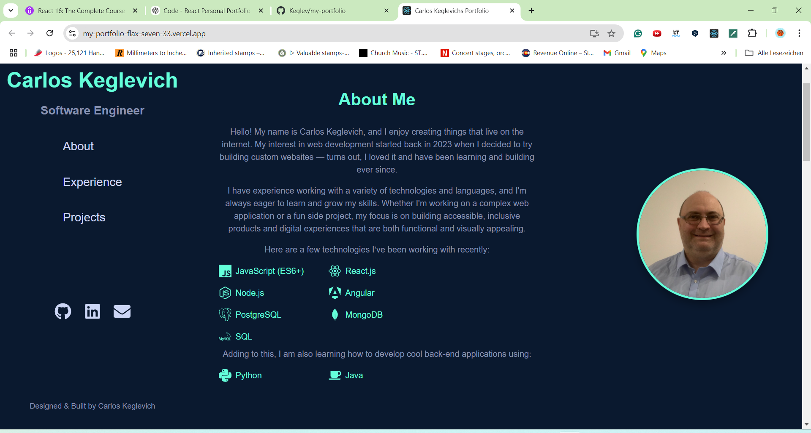
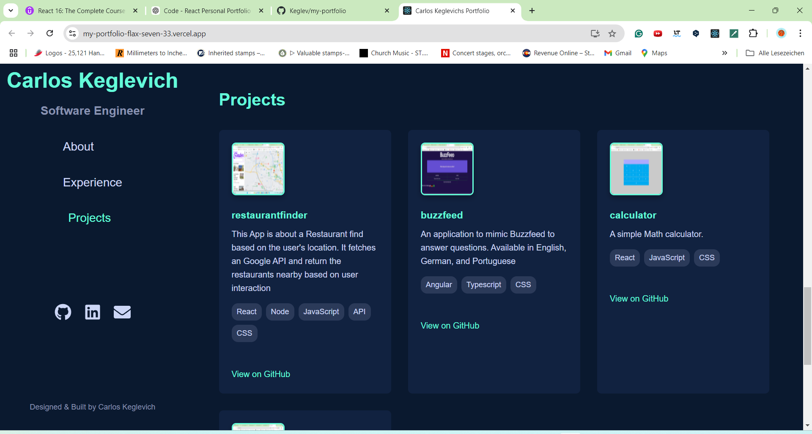

# About
This is a Portfolio Website. It showcases my skills and projects. 

# 💼 My Portfolio

Welcome to my personal portfolio website, showcasing my skills, projects, and experiences as a software engineer. This responsive web application is designed to provide visitors with an insight into my work, technical expertise, and professional journey.

## Table of Contents
- [Features](#features)
- [Screenshots](#screenshots)
- [Installation](#installation)
- [Usage](#usage)
- [Available Scripts](#available-scripts)
- [Technologies](#technologies)
- [API Integration](#API-Integration)
- [Contributing](#contributing)
 - [Documentation](#documentation)

## Features
✨ **Interactive Portfolio**: Explore featured projects, experience, and skills through a clean and interactive layout.

🖥️ **Responsive Design**: Optimized for various screen sizes including mobile, tablet, and desktop.

🙋 **About Section**: Provides a brief introduction, background, and expertise as a software engineer."

📂 **Projects Showcase**: A detailed presentation of my projects with descriptions and links to the GitHub repositories.

📂 **Repo Docs**: A link to my main project's documentation, like API, Architecture, and deployment techniques

👨‍💼 **Experience Section**: Display of my professional experience, highlighting key achievements and roles.

📫 **Contact Information Section**: Includes direct links to GitHub, LinkedIn, and email for easy communication.


## Screenshots

# Main image: A screenshot of the homepage showing the layout and header



# Image from the projects section: Displays the project cards fetched from GitHub.



## Installation

## Documentation

The generated API and developer documentation is published on GitHub Pages:

https://keglev.github.io/my-portfolio/jsdoc/index.html

You can also generate the docs locally with:

```powershell
npm run docs:jsdoc
```

To run this app locally, follow these steps:

1. Ensure you have Node.js and npm installed. If not, download them from Node.js.
   
2. Clone the repository:

  git clone https://github.com/Keglev/my-portfolio.git

3. Navigate to the project directory:
   
  cd my-portfolio

3. Install the dependencies:

   npm install

4. Get API keys from GitHub API and create a .env file in the project root:
   
   REACT_APP_GITHUB_API_TOKEN=your-GitHub-API-key

6. Start the development server:

   npm start

## Architecture docs
 Will be available soon

## Usage

This App is to showcase my portfolio. 
It fetches pinned repositories from GitHub and displays project images and descriptions
View Details: I already put some special characters in this read.me file, so it makes it easier for Java Script to treat this file and only get the important information to 
show on the website
I also added some designs to show my front-end skills in my portfolio.

## Available Scripts

In the project directory, you can run:

### `npm start`

Runs the app in the development mode.\
Open [http://localhost:3000](http://localhost:3000) to view it in your browser.

The page will reload when you make changes.\
You may also see any lint errors in the console.

### `npm test`

Launches the test runner in the interactive watch mode.\
See the section about [running tests](https://facebook.github.io/create-react-app/docs/running-tests) for more information.

### `npm run build`

Builds the app for production to the `build` folder.\
It correctly bundles React in production mode and optimizes the build for the best performance.

The build is minified and the filenames include the hashes.\
Your app is ready to be deployed!

See the section about [deployment](https://facebook.github.io/create-react-app/docs/deployment) for more information.

### `npm run eject`

**Note: this is a one-way operation. Once you `eject`, you can't go back!**

If you aren't satisfied with the build tool and configuration choices, you can `eject` at any time. This command will remove the single build dependency from your project.

## Test Strategy (short note)

This repository uses two test runners because the codebase contains both node-only scripts (in `scripts/`) and a Create React App frontend that requires CRA's Jest setup for CSS and asset transforms.

- Node-only tests (parsing helpers, scripts) run with a dedicated Jest config: `npm run test:node`.
- React/frontend tests run with Create React App's test runner: `npm run test:cra` (this is `react-scripts test`).
- To run both locally: `npm run test:all`.
- CI-friendly run (non-interactive): `npm run test:ci` (sets `CI=true`).

We document this now; a more detailed test guide will follow in a separate docs file.

## Technologies

- *React.js: Frontend framework for building user interfaces.
- *GrapQL: To fetch important information from the GitHub API.
- *Styled Components: CSS-in-JS library for styling components.
- *JavaScript (ES6+): Core language used throughout the app.
- GitHub Integration: Used for project images and other data fetching.
- HTML5 & CSS3: Standard web technologies for structuring and styling the app.

## API Integration

This app integrates with:

GitHub API: To display the App images from pinned repositories.
For more information, check out the GitHub API Documentation.

## Contributing

Contributions are welcome! Here's how you can contribute:

1. Fork the repository.
2. Create a new branch (git checkout -b feature/YourFeatureName).
3. Commit your changes (git commit -m 'Add some feature').
4. Commit your changes (git commit -m 'Add some feature').
5. Open a pull request.
