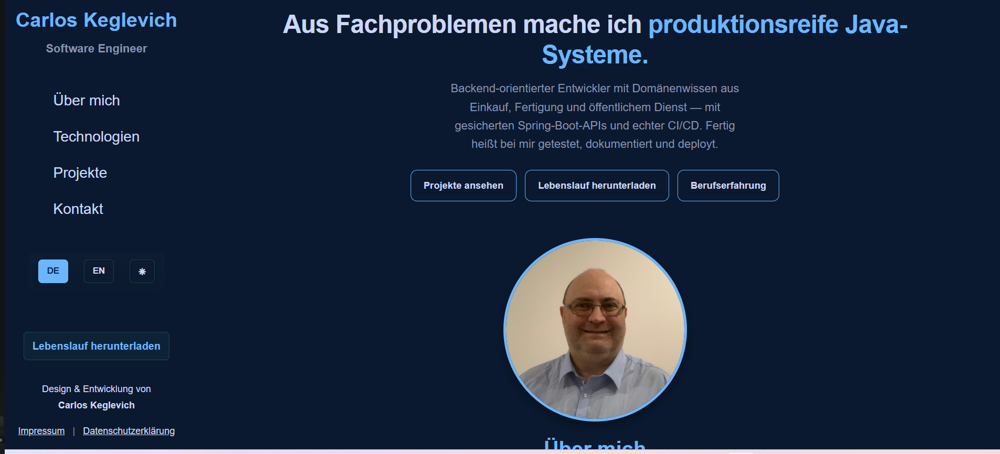
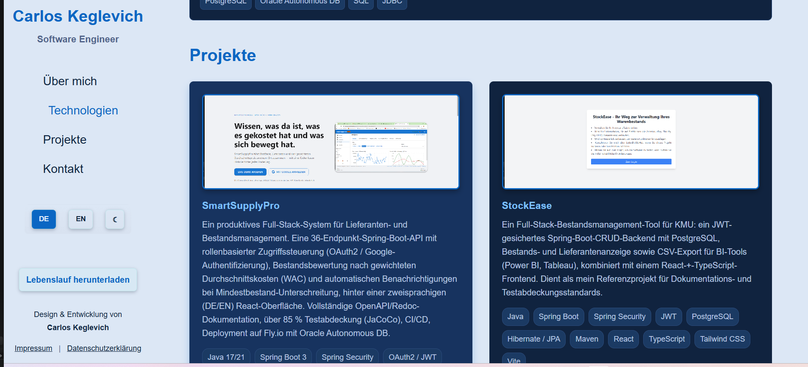

# About
This is a Portfolio Website. It showcases my skills and projects. You can use it for showing your skills and Portfolio projects too!  

# 💼 Description

Welcome to my personal portfolio website, showcasing my skills, projects, and experiences as a software engineer. This responsive web application is designed to provide visitors with an insight into my work, technical expertise, and professional journey. Project data is hand-curated as static code in `src/data/projects.config.js`, bundled directly into the build — there is no GitHub API call, at build time or at runtime. The site is fully bilingual (English and German) powered by i18next, and supports a light/dark theme toggle.

## Table of Contents

- [Screenshots](#screenshots)
- [Features](#features)
- [Project Status](#projectstatus)
- [Testing & Code Quality](#Testing-code-quality)
- [Documentation](#documentation)
- [API Integration](#API-Integration)
- [Technologies](#technologies)
- [Contributing](#contributing)

## Screenshots

# Main image: A screenshot of the homepage showing the layout and header



# Image from the projects section: Displays the curated project cards.



## Features

✨ **Interactive Portfolio**: Explore a hero introduction, projects, and skills through a clean and interactive layout.

🖥️ **Responsive Design**: Optimized for various screen sizes including mobile, tablet, and desktop.

🌗 **Light/Dark Theme**: Toggle between light and dark themes, persisted across visits.

🙋 **About Section**: A brief introduction and background, plus a condensed career/education strip.

🧠 **Skills Section**: A single-column overview of skill groups, grouped for fast scanning.

📂 **Projects Showcase**: A detailed presentation of my projects with descriptions, technology tags, and links to the live app, docs, and GitHub repositories.

📬 **Contact Form**: A Web3Forms-backed contact form with DSGVO consent, plus direct social links (GitHub, LinkedIn, Xing, email).

📄 **Resume Download**: Locale-aware CV download — English or German version served based on the active language.

⚖️ **Impressum & Privacy Policy**: German legal notices (Impressum and Datenschutz) accessible directly from the sidebar.

## Project Status

- ✅ Complete architecture documentation with component diagrams, data-flow diagrams, CI/CD pipeline overview, and 6 Architecture Decision Records (ADRs)

- ✅ Working CI/CD pipeline for build, test, and deployment

### 📚 Documentation Status 

- ✅ **arc42 architecture documentation**: 12 chapters — introduction & goals, constraints, context, solution strategy, building blocks, runtime view, deployment, crosscutting concepts, 6 ADRs, quality requirements, risks & technical debt, and a glossary

- ✅ **Testing documentation**: two-runner Jest strategy, coverage thresholds, and CI commands (chapter 08c)

- ✅ **Deployment documentation**: Vercel configuration, environment variables, and build pipeline (chapter 07)

## Testing & Code Quality

### Test Strategy (short note)

This repository uses two test runners because the codebase contains both node-only scripts (in `scripts/`) and a Create React App frontend that requires CRA's Jest setup for CSS and asset transforms.

- Node-only tests (parsing helpers, scripts) run with a dedicated Jest config: `npm run test:node`.
- React/frontend tests run with Create React App's test runner: `npm run test:cra` (this is `react-scripts test`).
- To run both locally: `npm run test:all`.
- CI-friendly run (non-interactive): `npm run test:ci` (sets `CI=true`).

Still under construction; a more detailed test guide will follow in a separate docs file.

## Documentation

## API Integration

The app itself makes no third-party API calls at build time or runtime — project data is hand-curated static code, and the only outbound request is the Contact form's submission to Web3Forms.

The test coverage report is published on GitHub Pages:

https://keglev.github.io/my-portfolio/coverage/index.html

You can regenerate it locally with:

```powershell
npm run test:coverage
```
## Architecture docs

Full architecture documentation — component diagrams, data-flow diagrams, CI/CD pipeline overview, a 9-ADR decision log, and a German-language overview — is published on GitHub Pages:

https://keglev.github.io/my-portfolio/

## Instalation

To run this app locally, follow these steps:

1. Ensure you have Node.js and npm installed. If not, download them from Node.js.
   
2. Clone the repository:

  git clone https://github.com/Keglev/my-portfolio.git

3. Navigate to the project directory:
   
  cd my-portfolio

4. Install the dependencies:

   npm install

5. (Optional, for the Contact form) Create a `.env` file in the project root with a Web3Forms access key:

   REACT_APP_WEB3FORMS_KEY=your-web3forms-access-key

6. Start the development server:

   npm start

## Usage

This app showcases my portfolio: projects, skills, and contact details, rendered from static, hand-curated data (no external fetch), styled with a custom design system that includes a light/dark theme.

## Available Scripts

In the project directory, you can run:

### `npm start`

Runs the app in the development mode.\
Open [http://localhost:3000](http://localhost:3000) to view it in your browser.

The page will reload when you make changes.\
You may also see any lint errors in the console.

### `npm test`

Launches the test runner in the interactive watch mode.\
See the section about [running tests](https://facebook.github.io/create-react-app/docs/running-tests) for more information.

### `npm run build`

Builds the app for production to the `build` folder.\
It correctly bundles React in production mode and optimizes the build for the best performance.

The build is minified and the filenames include the hashes.\
Your app is ready to be deployed!

See the section about [deployment](https://facebook.github.io/create-react-app/docs/deployment) for more information.

### `npm run eject`

**Note: this is a one-way operation. Once you `eject`, you can't go back!**

If you aren't satisfied with the build tool and configuration choices, you can `eject` at any time. This command will remove the single build dependency from your project.

## Technologies

- **React 18** (Create React App): Frontend framework for building user interfaces.
- **styled-components**: CSS-in-JS library for the sidebar's interactive components.
- **i18next / react-i18next**: Internationalisation, English and German.
- **react-scroll**: Smooth-scroll navigation between in-page sections.
- **Web3Forms**: Static-site-friendly contact form backend (native `fetch`, no server of our own).
- **JavaScript (ES6+)**: Core language used throughout the app.
- **HTML5 & CSS3**: Standard web technologies for structuring and styling the app.

## Contributing

Contributions are welcome! Here's how you can contribute:

1. Fork the repository.
2. Create a new branch (git checkout -b feature/YourFeatureName).
3. Commit your changes (git commit -m 'Add some feature').
4. Push the branch and open a pull request.
