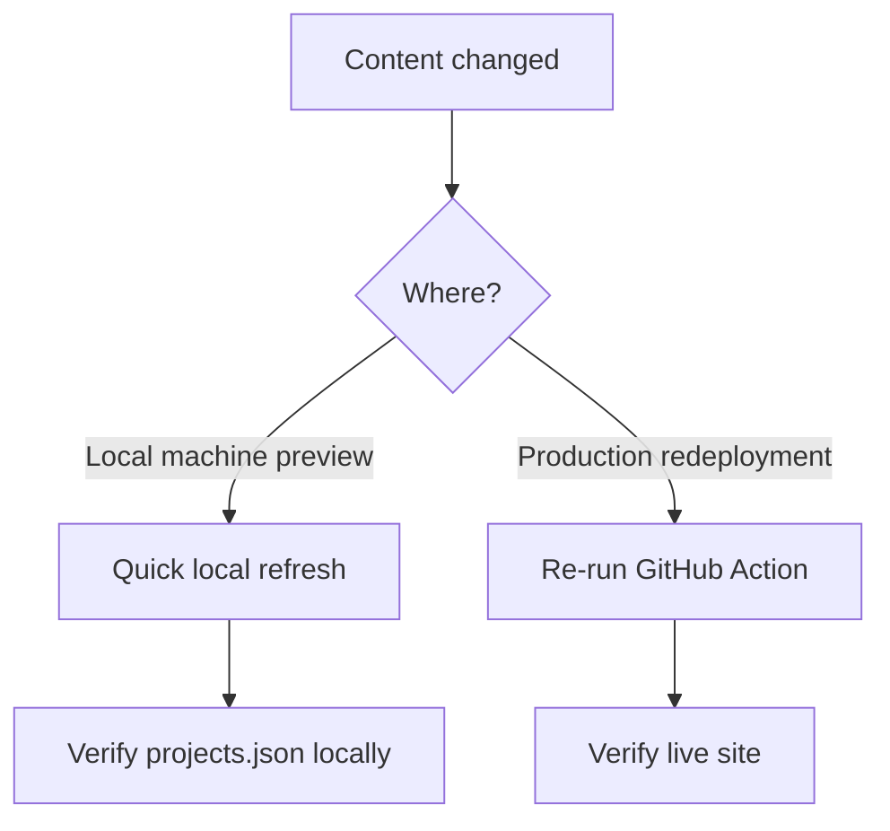

# Refresh

A "refresh" means regenerating `public/projects.json` and `public/projects_media/` from GitHub data and then redeploying the site. It does not change application code — only the static data artifacts that the React app reads at runtime.

## Contents

- [When to run a refresh](#when-to-run-a-refresh)
- [Quick local refresh](#quick-local-refresh)
- [Re-run via GitHub Actions](#re-run-via-github-actions)
- [Triggering only code or only docs](#triggering-only-code-or-only-docs)
- [Enterprise approaches](#enterprise-approaches)
- [Recommended minimal setup](#recommended-minimal-setup)
- [After the refresh](#after-the-refresh)
- [References](#references)

## When to run a refresh

Run a refresh when any of the following conditions are true:

- A README.md in one of your pinned GitHub repositories changed
- Documentation files in a linked project repository changed
- You added, removed, or reordered pinned repositories on GitHub
- You want to preview the regenerated content locally before pushing



## Quick local refresh

These steps reproduce what CI does, so local output matches what Vercel will produce.

1. Open PowerShell at the repository root (`my-portfolio`).
2. Optionally set the DeepL secret for this session only:

```powershell
# $env:DEEPL_SECRET = 'your_deepl_secret_here'   # do NOT commit this
# $env:DEEPL_API_KEY = 'your_deepl_key_here'     # alternative name supported
```

3. Run the fetch, postprocess, and optional fallback scan:

```powershell
node .\scripts\fetchProjects.js
node .\scripts\postprocessProjects.js
node .\scripts\applyFallbackDocScan.js   # optional
```

4. Build the React app:

```powershell
npm run build
```

5. Optionally prepare the Vercel prebuilt output (only needed when deploying with `vercel --prebuilt`):

```powershell
Remove-Item -Recurse -Force .vercel\output -ErrorAction SilentlyContinue
New-Item -ItemType Directory -Force .vercel\output\static | Out-Null
Copy-Item -Path build\* -Destination .vercel\output\static -Recurse -Force
Copy-Item -Path public\projects.json -Destination .vercel\output\static\projects.json -Force
Copy-Item -Path public\projects_media -Destination .vercel\output\static\projects_media -Recurse -Force

@"
{
  "version": 3,
  "routes": [
    { "handle": "filesystem" },
    { "src": "/(.*)", "dest": "/index.html" }
  ]
}
"@ | Out-File -FilePath .vercel\output\config.json -Encoding utf8
```

6. Deploy with the Vercel CLI (optional):

```powershell
npx vercel --prebuilt . --token $env:VERCEL_TOKEN --yes
```

### Explicit fetch and postprocess commands

If you only want the data regeneration steps without a full build, paste these into PowerShell from the repository root:

```powershell
# Optional: provide a GitHub token so the pipeline can read private or rate-limited repos
$env:GH_PROJECTS_TOKEN = 'ghp_xxx'

# Fetch README data, media, and generate public/projects.json
node .\scripts\fetchProjects.js

# Normalize and prefer github.io doc links where available
node .\scripts\postprocessProjects.js
```

If `GH_PROJECTS_TOKEN` is not set, `fetchProjects.js` skips network fetches and `postprocessProjects.js` operates on the existing `public/projects.json` if present. Never commit secrets.

## Re-run via GitHub Actions

Triggering the workflow from GitHub Actions is the recommended approach for regular production refreshes.

1. Go to **GitHub → Actions → "Build and Fetch Projects"** (or your workflow name).
2. Click **Run workflow** and select the `main` branch.
3. Alternatively, use the GitHub CLI:

```bash
gh workflow run build-and-fetch.yml --repo Keglev/my-portfolio --ref main
```

If `DEEPL_SECRET` (or `DEEPL_API_KEY`) is set in repository secrets, the Action runs translations during the fetch step. The workflow creates the `.vercel/output` prebuilt artifact and deploys it with `vercel --prebuilt`.

## Triggering only code or only docs

If you want documentation updates to trigger a lighter pipeline than a full code build, two approaches work well.

### Path-filtered workflows (single repo)

Create two workflows in `.github/workflows/`:

- `build-and-fetch.yml` — triggers on code changes (`src/**`, `package.json`, `public/**`)
- `docs-refresh.yml` — triggers on README or docs changes

Example `docs-refresh.yml` trigger:

```yaml
name: Docs refresh
on:
  push:
    branches: [ main ]
    paths:
      - '**/README.md'
      - 'projects/**'
      - 'docs/**'
  workflow_dispatch:

jobs:
  docs:
    runs-on: ubuntu-latest
    steps:
      - uses: actions/checkout@v4
      - name: Install
        run: npm ci --legacy-peer-deps
      - name: Fetch and postprocess
        env:
          GITHUB_TOKEN: ${{ secrets.GITHUB_TOKEN }}
          GH_PROJECTS_TOKEN: ${{ secrets.GH_PROJECTS_TOKEN }}
          DEEPL_SECRET: ${{ secrets.DEEPL_SECRET }}
        run: |
          node scripts/fetchProjects.js
          node scripts/postprocessProjects.js
          node scripts/applyFallbackDocScan.js
      - name: Build and prepare prebuilt
        run: npm run build
```

### Separate docs repository

Move docs into a separate repository and use webhooks or `repository_dispatch` events to trigger the portfolio repository's docs workflow. This decouples permissions and allows different reviewers, CI quotas, and schedules.

## Enterprise approaches

For portfolios that span multiple repositories and require auditable, scalable pipelines, consider these patterns.

### Separate code and docs pipelines

- Code pipeline: triggers on application code changes and performs a full build and deployment
- Docs pipeline: triggers on README or docs changes and produces only a data artifact (`projects.json`)

Advantages:
- Reduced build time — docs builds can be lighter and run more frequently
- Lower blast radius — docs deploys do not change application code
- Simpler approvals — different deployment gates for docs versus code

### Artifact store and deploy hooks

Produce deterministic artifacts in CI (upload `projects.json` and `projects_media` to an artifact store or S3). Use Vercel deploy hooks or the Vercel API to trigger a deploy when artifacts change, avoiding a full app rebuild.

### Cross-repository triggers

Use `repository_dispatch` or a dedicated CI user with a PAT to call the portfolio workflow when docs change in other repositories. A GitHub App can orchestrate cross-repository events and maintain audit logs.

### Secret handling at scale

- Store secrets in the CI provider's secret store. Avoid printing secrets in logs.
- Use `permissions` blocks and environment protections to limit which workflows can access which secrets.

### Observability and approvals

- Add a verification step to print the number of repos and doc links before deploy.
- For production, add required approvals via GitHub Environments and Slack or Teams notifications on deploys.

### Caching and incremental builds

Use content-hash-based caching — persist and compare `meta.json` per project (your scripts already write `projects_media/*/meta.json`) to skip expensive downloads or translations when content has not changed.

## Recommended minimal setup

Given the current project structure, the smallest change that adds meaningful separation between code and docs pipelines:

1. Keep the current repository and workflows as-is.
2. Add one `docs-refresh.yml` workflow that triggers on changes to `**/README.md` and `docs/**` (example above). This regenerates `projects.json` and runs a prebuilt Vercel deploy without touching the code-triggered workflow.
3. Add `DEEPL_SECRET` as a GitHub Actions secret if translations are needed during docs runs.

## After the refresh

After running either the local steps or the GitHub Action, verify the following:

1. Open `public/projects.json` and confirm it contains the expected repositories and updated summaries.
2. Check that `public/projects_media/<repo>/` directories exist for each project with a media asset.
3. If deployed, open the live site and confirm the Projects section renders the refreshed data.
4. For a quick API check from PowerShell:

```powershell
Invoke-RestMethod 'https://your-domain.example.com/projects.json' | Select-Object -First 1
```

## References

- [GitHub Actions — workflow triggers](https://docs.github.com/en/actions/writing-workflows/choosing-when-your-workflow-runs/events-that-trigger-workflows)
- [Vercel deploy hooks](https://vercel.com/docs/deployments/deploy-hooks)
- [GitHub — repository_dispatch event](https://docs.github.com/en/rest/repos/repos#create-a-repository-dispatch-event)
