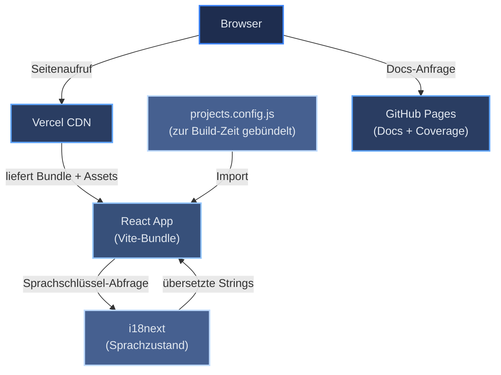

# Einführung und Ziele

[← Architekturindex](index.md)

Dieses persönliche Portfolio ist eine Single-Page-Anwendung, erstellt mit React und Vite. Es präsentiert eine Hero-Einführung, einen About-Bereich mit einer kompakten Karriere-/Ausbildungsübersicht, eine Skills-Übersicht, eine Projektpräsentation, ein Kontaktformular und rechtliche Hinweise — auf Englisch und Deutsch. Die Projektdaten sind als statischer, handkuratierter Code in `src/data/projects.config.js` hinterlegt und direkt im JavaScript-Build gebündelt; es gibt keinen GitHub-API-Aufruf, weder zur Build-Zeit noch zur Laufzeit. Die gebaute App wird auf Vercel bereitgestellt; generierte Dokumentation und Test-Coverage-Berichte werden separat auf GitHub Pages veröffentlicht.

## Inhaltsverzeichnis

- [Tech-Stack](#tech-stack)
- [Komponentendiagramm](#komponentendiagramm)
- [Referenzen](#referenzen)

## Tech-Stack

Die folgende Tabelle ordnet jede Architekturebene der gewählten Technologie und dem Grund für die Wahl zu. Die Begründung hinter jeder Wahl steht in [Lösungsstrategie](04-solution-strategy.md); die Rahmenbedingungen, innerhalb derer diese Entscheidungen getroffen wurden, stehen in [Randbedingungen](02-constraints.md).

| Ebene | Technologie | Begründung |
|-------|-------------|-----------|
| UI-Framework | React 18 | Ausgereiftes Ökosystem; die größte Menge an Dokumentation und Antworten für eine einzelne wartende Person |
| Build-Tooling | Vite 8 | Schneller Dev-Server und Build; ersetzt Create React App, das im Februar 2025 eingestellt wurde — siehe [ADR-007](09-decisions/ADR-007-vite-migration.md) |
| Styling | styled-components 6 | Komponentenlokale Styles, keine Class-Name-Kollisionen |
| Scroll-Navigation | react-scroll | Sanftes Scrollen zu Seitenabschnitten; kein Server oder Router erforderlich |
| Internationalisierung | i18next 25 + react-i18next 14 | Industriestandard-i18n, React-Hooks-API, JSON-Namespace-Unterstützung |
| Kontaktformular | Web3Forms (natives `fetch`) | Static-Site-freundliches Formular-Backend — kein eigener Server nötig |
| Icons | react-icons 5 | Social-/Kontakt-Icon-Set (GitHub, LinkedIn, Xing, E-Mail) |
| Analytics | Vercel Speed Insights | Zero-Config Core Web Vitals-Monitoring; ohne Cookies |
| Testing | Vitest + React Testing Library | Ein Runner, der sich die Build-Toolchain teilt; Tests werden exakt so transformiert wie die App |
| Linting | ESLint 9 (Flat Config) | Fehler vor CI abfangen; das Regelwerk ist explizit statt von einem Preset geerbt |
| CI/CD | GitHub Actions (4 Workflows) | Kostenlos für öffentliche Repos, native GitHub-Integration |
| App-Hosting | Vercel | Automatisches HTTPS, Edge-CDN, Prebuilt-Artifact-Deployment |
| Docs-Hosting | GitHub Pages (gh-pages-Branch) | Kostenloses statisches Hosting, zusammen mit dem Repository |

## Komponentendiagramm

Das folgende Diagramm zeigt den Laufzeitfluss von einer Browser-Anfrage durch die bereitgestellte Infrastruktur.

Zentrale Designentscheidungen (statische Projektdaten, Prebuilt-Artifact-Deployment, zwei Test-Runner usw.) stehen in [Lösungsstrategie](04-solution-strategy.md), nicht hier — dieses Kapitel konzentriert sich auf *was* das System ist; Kapitel 04 behandelt *warum* es so gebaut ist, wie es ist. Nichtfunktionale Anforderungen haben ebenfalls ein eigenes Kapitel: siehe [Qualitätsanforderungen](10-quality-requirements.md).

## Referenzen

- [React-Dokumentation](https://react.dev)
- [i18next-Dokumentation](https://www.i18next.com)
- [Vercel-Dokumentation](https://vercel.com/docs)
- [Vite Dokumentation](https://vite.dev)
- [GitHub Actions Dokumentation](https://docs.github.com/en/actions)
