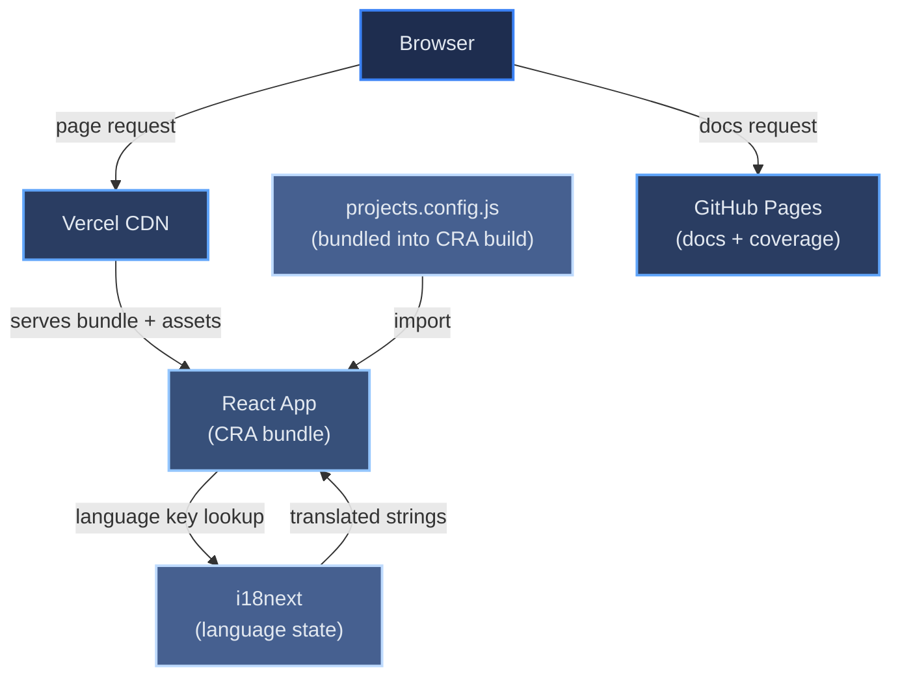

# Portfolio Architecture Overview

[← Architecture index](index.md)

This personal portfolio is a single-page React application built with Create React App. It presents professional information — experience, education, projects, and legal notices — in both English and German. Project data is pre-generated at build time by fetching pinned GitHub repositories via the GitHub GraphQL API and stored as static JSON, eliminating any runtime API dependency. The built app is deployed to Vercel; generated documentation and test coverage reports are published separately to GitHub Pages.

## Table of Contents

- [Tech Stack](#tech-stack)
- [Component Diagram](#component-diagram)
- [Key Design Decisions](#key-design-decisions)
- [Non-Functional Requirements](#non-functional-requirements)
- [References](#references)

## Tech Stack

The table below maps each architectural layer to the chosen technology and the reason for that choice.

| Layer | Technology | Why |
|-------|-----------|-----|
| UI framework | React 18 (Create React App) | Mature ecosystem; CRA provides zero-config build tooling |
| Styling | styled-components 6 | Co-located styles, no class-name collisions |
| Routing / scroll | react-router-dom 6, react-scroll | Hash-based navigation with smooth scroll; no server required |
| Internationalisation | i18next 25 + react-i18next 14 | Industry-standard i18n, React hooks API, JSON namespace support |
| HTTP client | axios 1 | Consistent API across environments for GitHub API calls |
| Analytics | Vercel Speed Insights | Zero-config Core Web Vitals tracking; no cookies |
| Testing | Jest + React Testing Library | Component-level unit tests aligned with user behaviour |
| Linting | ESLint (react-app config) | Catches issues before CI runs without extra configuration |
| CI/CD | GitHub Actions (3 workflows) | Free for public repos, native GitHub integration |
| App hosting | Vercel | Automatic HTTPS, edge CDN, prebuilt artifact deployment |
| Docs hosting | GitHub Pages (gh-pages branch) | Free static hosting co-located with the repository |

## Component Diagram

The diagram below shows the runtime flow from a browser request through the deployed infrastructure.

## Key Design Decisions

Each decision below links to the document where it is discussed in detail.

- **Static, hand-curated project data** — project copy, tech tags, and images live in `src/data/projects.config.js` and are bundled at build time, removing any GitHub API dependency from the live site. See [ADR-006](09-decisions/ADR-006-build-time-github-data-fetch.md) for why an earlier build-time fetch pipeline was retired in favor of this.
- **Vercel prebuilt artifact** — the app is built in GitHub Actions and deployed as a `.vercel/output` artifact, giving full control over the build environment. See [DEPLOY.md](07b-deployment-configuration.md).
- **Two test runners** — Node-only scripts use a separate Jest config from the CRA runner to avoid Babel/CSS transform conflicts. See [TESTS.md](08c-concepts-testing.md).
- **Default locale German** — `lng: 'de'` in i18next because the portfolio targets a German-speaking job market. See [i18n-flow.md](08b-concepts-i18n-theming.md).
- **No client-side state library** — component-local `useState` is sufficient; no shared mutable state exists across unrelated components. See [data-flow.md](06-runtime.md).

## Non-Functional Requirements

| Requirement | Approach |
|-------------|----------|
| Performance | Static JSON served from Vercel CDN; no runtime API calls; Speed Insights monitors Core Web Vitals |
| Accessibility | Semantic HTML section anchors; `aria-label` on icon-only buttons; keyboard-navigable sidebar |
| Internationalisation | Full EN/DE support via i18next; default locale German; all visible strings in locale JSON files |
| Reliability | `ErrorBoundary` wraps the entire React tree; CI blocks deployment on any test or lint failure |
| Maintainability | Generated docs and coverage published to GitHub Pages on every successful deployment |

## References

- [React documentation](https://react.dev)
- [i18next documentation](https://www.i18next.com)
- [Vercel documentation](https://vercel.com/docs)
- [Create React App documentation](https://create-react-app.dev)
- [GitHub Actions documentation](https://docs.github.com/en/actions)
