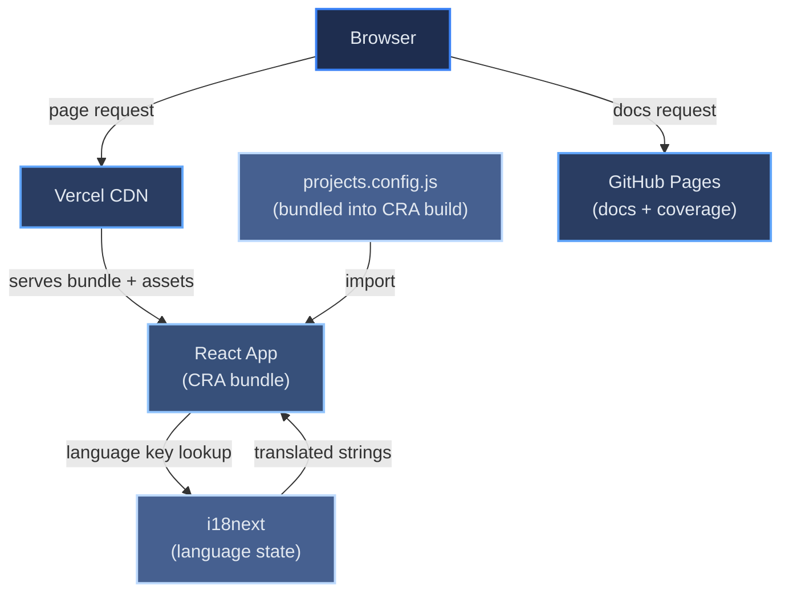

# Introduction and Goals

[← Architecture index](index.md)

This personal portfolio is a single-page React application built with Create React App. It presents a hero introduction, an about section with a condensed career/education strip, a skills overview, a project showcase, a contact form, and legal notices — in both English and German. Project data is hand-curated as static code in `src/data/projects.config.js`, bundled directly into the JavaScript build; there is no GitHub API call, at build time or at runtime. The built app is deployed to Vercel; generated documentation and test coverage reports are published separately to GitHub Pages.

## Table of Contents

- [Tech Stack](#tech-stack)
- [Component Diagram](#component-diagram)
- [References](#references)

## Tech Stack

The table below maps each architectural layer to the chosen technology and the reason for that choice. For the reasoning behind each choice, see [Solution Strategy](04-solution-strategy.md); for the constraints these choices work within, see [Constraints](02-constraints.md).

| Layer | Technology | Why |
|-------|-----------|-----|
| UI framework | React 18 (Create React App) | Mature ecosystem; CRA provides zero-config build tooling |
| Styling | styled-components 6 | Co-located styles, no class-name collisions |
| Scroll navigation | react-scroll | Smooth-scroll to in-page sections; no server or router required |
| Internationalisation | i18next 25 + react-i18next 14 | Industry-standard i18n, React hooks API, JSON namespace support |
| Contact form | Web3Forms (native `fetch`) | Static-site-friendly form backend — no server of our own needed |
| Icons | react-icons 5 | Social/contact icon set (GitHub, LinkedIn, Xing, email) |
| Analytics | Vercel Speed Insights | Zero-config Core Web Vitals tracking; no cookies |
| Testing | Jest + React Testing Library | Component-level unit tests aligned with user behaviour |
| Linting | ESLint (react-app config) | Catches issues before CI runs without extra configuration |
| CI/CD | GitHub Actions (4 workflows) | Free for public repos, native GitHub integration |
| App hosting | Vercel | Automatic HTTPS, edge CDN, prebuilt artifact deployment |
| Docs hosting | GitHub Pages (gh-pages branch) | Free static hosting co-located with the repository |

## Component Diagram

The diagram below shows the runtime flow from a browser request through the deployed infrastructure.

Key design decisions (static project data, prebuilt-artifact deployment, two test runners, and so on) live in [Solution Strategy](04-solution-strategy.md), not here — this chapter stays focused on *what* the system is; chapter 04 covers *why* it's built the way it is. Non-functional requirements have their own chapter too: see [Quality Requirements](10-quality-requirements.md).

## References

- [React documentation](https://react.dev)
- [i18next documentation](https://www.i18next.com)
- [Vercel documentation](https://vercel.com/docs)
- [Create React App documentation](https://create-react-app.dev)
- [GitHub Actions documentation](https://docs.github.com/en/actions)
