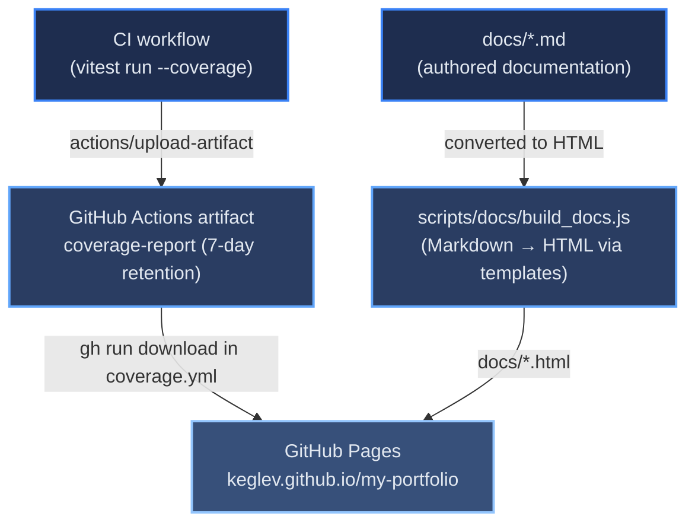

# Context and Scope

[← Architecture index](index.md)

The system boundary: who and what interacts with the portfolio, and through which technical channels. For configuration details (environment variables, step-by-step commands), see [DEPLOY.md](07b-deployment-configuration.md). For the CI/CD workflow trigger chain, see [Deployment](07-deployment.md).

## Table of Contents

- [Business Context](#business-context)
- [Technical Context: Configuration Inputs](#technical-context-configuration-inputs)
- [Technical Context: Documentation and Coverage Flow](#technical-context-documentation-and-coverage-flow)
- [Technical Context: Artifact Summary](#technical-context-artifact-summary)
- [References](#references)

## Business Context

| Actor | Interaction |
|-------|-------------|
| Site visitor | Browses the live portfolio at https://carloskeglevich.de — no account, no write access, read-only |
| Recruiter / employer | The portfolio's primary intended audience; drives the German-default-locale decision (see [Constraints](02-constraints.md)) |
| GitHub | Hosts the source repository, runs CI/CD via GitHub Actions, and serves generated docs/coverage from the `gh-pages` branch |
| Vercel | Hosts the live production build, served from its global edge CDN |

There is no runtime API dependency and no user-generated content — every external interaction is either a visitor's browser reading a static page, or the CI/CD pipeline itself reading its own configuration. That absence of a live backend is itself the most consequential fact in this system's context.

## Technical Context: Configuration Inputs

Two categories of external input must be available as environment variables in the GitHub Actions runner before the build pipeline can deploy.

| Input | Provided by | Consumed by | Required |
|-------|------------|-------------|----------|
| `VERCEL_TOKEN`, `VERCEL_ORG_ID`, `VERCEL_PROJECT_ID` | GitHub repository secrets | Vercel CLI deploy step | Yes |
| `VITE_WEB3FORMS_KEY` | GitHub repository secret | `npm run build` — baked into the bundle for the contact form | Yes |
| `GITHUB_TOKEN` | Automatically injected by Actions | `gh` CLI calls in `ci.yml`, `coverage.yml`, `architecture-docs.yml` | Yes (automatic) |

`VITE_WEB3FORMS_KEY` is the only application secret the build consumes. It is a Web3Forms *public* access key: the value is deliberately visible in the deployed JavaScript, and it lives in Actions secrets to keep it out of git history, not because exposure would be a breach. `deploy.yml` fails fast when it is unset, because a build that silently ships an empty key produces a contact form that accepts submissions and delivers nothing.

One secret that used to be here is gone. A GitHub personal access token was once required at build time, to read repository READMEs and pinned-project data for the Projects section. That fetch was retired along with `scripts/fetchProjects.js` (see [ADR-006](09-decisions/ADR-006-build-time-github-data-fetch.md)); project copy is now hand-curated in `src/data/projects.config.js`. No personal access token is used anywhere in this pipeline. The `GITHUB_TOKEN` in the table above is a different thing entirely — the ephemeral, per-run token Actions injects for `gh` CLI calls against this repository.

## Technical Context: Documentation and Coverage Flow

The diagram below shows how documentation sources and the test coverage report flow into GitHub Pages independently of the Vercel deployment.

The right side of this diagram is split across two workflows. `coverage.yml` handles the coverage branch — it is dispatched by `ci.yml` in parallel with `deploy.yml` (not after it), and only when a `src/**` change could have altered the report. `architecture-docs.yml` handles the Markdown-to-HTML branch — it triggers directly on pushes to `docs/**` or `scripts/docs/**`, independently of the deploy chain, which lets small documentation edits publish without running the full pipeline.

## Technical Context: Artifact Summary

The table below lists every intermediate and final artifact produced by the deployment system, where it originates, and where it lands.

| Artifact | Produced by | Stage | Destination |
|----------|------------|-------|-------------|
| `dist/` | `npm run build` (Vite) | Build-time | Merged into `.vercel/output/static/` |
| `.vercel/output/static/` | `scripts/prepareVercelOutput.sh` | Pre-deploy | Deployed to Vercel CDN |
| `coverage/` | Vitest (`npm run test:coverage` in CI) | CI | Uploaded as `coverage-report` artifact; later downloaded into `docs/coverage/` by coverage.yml |
| `docs/*.html` | `scripts/docs/build_docs.js` | architecture-docs.yml | Published to `gh-pages` branch (staged copy excluding `coverage/`) |
| `docs/_theme/css/styles.css` | `scripts/docs/build_docs.js` (concatenated from `docs/_theme/css/*.css`) | architecture-docs.yml | Published to `gh-pages` branch alongside `docs/*.html` |

## References

- [DEPLOY.md](07b-deployment-configuration.md) — environment variables, manual deployment commands, and security notes
- [architecture/ci-cd-pipeline.md](07-deployment.md) — workflow trigger chain and step details
- [Constraints](02-constraints.md) — the no-backend, static-hosting-only constraints this context reflects
