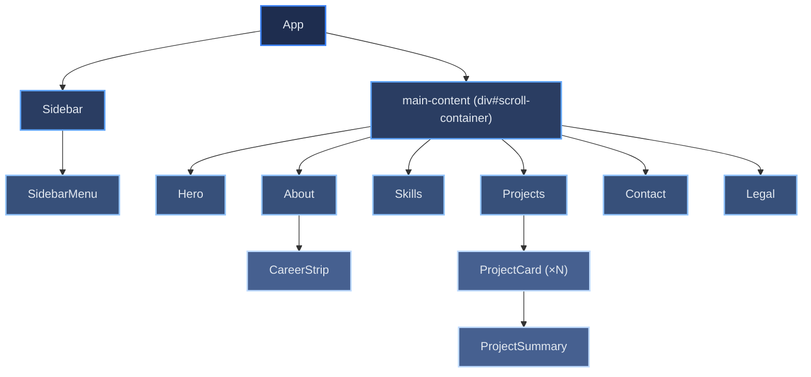

# Building Blocks

[← Architecture index](index.md)

This document maps the React component hierarchy from the root `App` component down to the major UI components. Understanding this tree helps when tracing a rendering issue or deciding where to introduce new state. For per-component prop tables, see [05b: Component Catalog](05b-building-blocks-components.md).

## Table of Contents

- [Component Hierarchy Diagram](#component-hierarchy-diagram)
- [Entry Point](#entry-point)
- [Sidebar Group](#sidebar-group)
- [Section Components](#section-components)
- [Projects Group](#projects-group)
- [References](#references)

## Component Hierarchy Diagram

The diagram shows every component `App` renders. Infrastructure utilities (`SpeedInsights`, `GlobalStyles`, `ThemeProvider`) are omitted from the diagram to keep the focus on UI structure — see [Entry Point](#entry-point) below for where they sit.

## Entry Point

`src/index.js` mounts the tree as `<React.StrictMode><ErrorBoundary><App /></ErrorBoundary></React.StrictMode>` — `StrictMode` is the outermost wrapper, `ErrorBoundary` sits inside it, one level above `App`. `App` itself wraps its own render in `ThemeProvider` (see [Theme System](08b-concepts-i18n-theming.md#theme-system)), so every descendant can read the active theme via `useTheme()`.

## Sidebar Group

The `Sidebar` component is fixed to the left of the viewport for the entire user session. It owns navigation, identity, and utility controls, and tracks an `activeSection` state derived from scroll position — it listens to `window.scroll` and iterates through sections bottom-to-top, so the deepest section the user has scrolled past is always the active one.

`Sidebar` renders its own name/title block and footer directly (via styled-components from `SidebarStyles.js`, see [08b's styled-components layer](08b-concepts-i18n-theming.md#styled-components-layer)) and delegates the interactive controls to one sub-component:

| Sub-component | Responsibility |
|--------------|---------------|
| `SidebarMenu` | Navigation links for each content section (receives `activeSection` as a prop, uses `react-scroll` for smooth scrolling), the DE/EN language switch, the theme toggle button, and the CV download link |

## Section Components

The main content area renders six section components in source order, each wrapped in a `div.section` with an `id` matching the `react-scroll` target used by `SidebarMenu`.

| Section | Responsibility |
|---------|---------------|
| `Hero` | First-viewport introduction: eyebrow line, headline, lead paragraph, and three CTAs (jump to Projects, download CV, jump to the career strip) |
| `About` | Profile photo and four fixed-order storytelling blocks; renders `CareerStrip` as its final child |
| `CareerStrip` | Condensed two-column career/education strip — replaces what were previously full standalone Education and Experience sections |
| `Skills` | Single-column stack of skill groups sourced from `data/skills.config`; deliberately not a grid, so a recruiter can scan it without horizontal eye movement |
| `Projects` | Project grid sourced from the static `data/projects.config` (no runtime or build-time fetch) |
| `Contact` | Web3Forms-backed contact form (DSGVO consent checkbox, honeypot spam field) plus a row of direct social/email links |
| `Legal` | Impressum and Datenschutz (privacy policy) content rendered from i18n HTML strings |

## Projects Group

`Projects` reads `data/projects.config` directly — there is no fetch, loading state, or custom data hook. It renders one `ProjectCard` per entry and, below the grid, a small "portfolio meta" strip linking to this repository's own source, docs, and coverage report.

- `ProjectCard` — renders a single project tile: theme- and language-aware preview image (via `useTheme()`), title, summary, technology tags, and up to five links in a locked order.
- `ProjectSummary` — renders the German or English summary field (`summaryDe`/`summaryEn`), both always present in the config.
- `projectsUtils` — exports `generatePlaceholderSVGDataUrl`, the inline-SVG fallback shown when a project's preview image fails to load.

## References

- [React component composition](https://react.dev/learn/passing-props-to-a-component)
- [react-scroll documentation](https://github.com/fisshy/react-scroll)
- [06-runtime.md](06-runtime.md) — props and state flow between these components
- [08b: i18n & Theming](08b-concepts-i18n-theming.md) — how translated strings and the active theme reach each component
