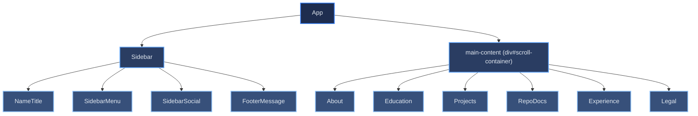

# React Component Tree

[← Architecture index](index.md)

This document maps the React component hierarchy from the root `App` component down to the major UI components. Understanding this tree helps when tracing a rendering issue or deciding where to introduce new state.

## Table of Contents

- [Component Hierarchy Diagram](#component-hierarchy-diagram)
- [Sidebar Group](#sidebar-group)
- [Section Components](#section-components)
- [Projects Group](#projects-group)
- [RepoDocs Group](#repodocs-group)
- [References](#references)

## Component Hierarchy Diagram

The diagram shows all significant rendering components. Infrastructure utilities (`SpeedInsights`, `GlobalStyles`) are omitted to keep the focus on UI structure.

## Sidebar Group

The `Sidebar` component is fixed to the left of the viewport for the entire user session. It owns all navigation, identity, and utility controls.

`Sidebar` maintains an `activeSection` state derived from scroll position. It listens to `window.scroll` and iterates through sections bottom-to-top, so the deepest section the user has scrolled past is always the active one.

| Sub-component | Responsibility |
|--------------|---------------|
| `NameTitle` | Styled block displaying the owner's name and job title from the `translation` i18n namespace |
| `SidebarMenu` | Navigation links for each content section; receives `activeSection` as a prop and highlights the matching link; uses `react-scroll` for smooth scrolling |
| `SidebarSocial` | Icon links to GitHub, LinkedIn, and email; each carries an `aria-label` for screen reader support |
| `FooterMessage` | Tagline and two `LegalButton` elements that scroll to the Impressum and Privacy Policy sections |

## Section Components

The main content area renders six section components in source order. Each is wrapped in a `div.section` with an `id` matching the `react-scroll` target used by `SidebarMenu`.

| Section | Responsibility |
|---------|---------------|
| `About` | Introductory bio and tech-stack summary |
| `Education` | Formal degrees, certifications, and ongoing training entries |
| `Projects` | Dynamically rendered project grid sourced from `public/projects.json` |
| `RepoDocs` | Links to repository documentation extracted from project READMEs at build time |
| `Experience` | Job history entries rendered from the `experienceSection` i18n keys |
| `Legal` | Impressum and Datenschutz (privacy policy) content rendered from i18n HTML strings |

## Projects Group

`Projects` fetches `public/projects.json` on mount and delegates rendering to two sub-components. The fetch lifecycle (loading, error, data states) is encapsulated in the `useProjects` custom hook, keeping the component itself free of async logic.

- `ProjectCard` — renders a single project tile with name, description, technology tags, and action links.
- `ProjectSummary` — compact summary row used in an alternate list view.
- `useProjects` — custom hook owning the fetch lifecycle.
- `projectsUtils` — pure utility functions for filtering and sorting project data.

## RepoDocs Group

`RepoDocs` renders documentation links that were extracted from each project's README during the build-time fetch step.

- `RepoDocLinks` — renders the list of doc links for a single repository entry.
- `useRepoDocs` — custom hook that derives the doc link list from the `projects.json` data.

## References

- [React component composition](https://react.dev/learn/passing-props-to-a-component)
- [react-scroll documentation](https://github.com/fisshy/react-scroll)
- [data-flow.md](06-runtime.md) — props and state flow between these components
- [i18n-flow.md](08b-concepts-i18n-theming.md) — how translated strings reach each component
