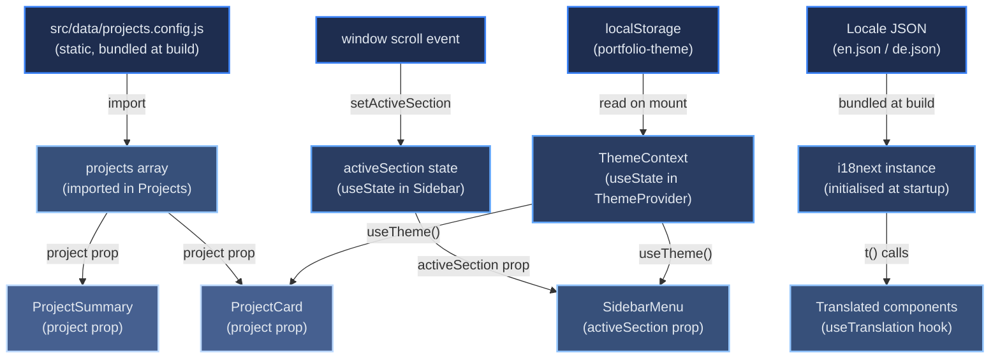

# Data Flow

[← Architecture index](index.md)

This document explains how data moves through the portfolio at build time and at runtime, and describes the state management approach.

## Table of Contents

- [Build-Time Data Preparation](#build-time-data-preparation)
- [Runtime Data Flow](#runtime-data-flow)
- [State Management Approach](#state-management-approach)
- [References](#references)

## Build-Time Data Preparation

The Projects section renders from `src/data/projects.config.js`, a hand-curated static module bundled directly into the JavaScript build. There is no build-time or runtime call to the GitHub API — project copy, tech tags, and images are authored and reviewed as code, not inherited from README files.

## Runtime Data Flow

The diagram below shows the principal data flows during a user session. Arrows represent data movement; node labels identify the source or consumer.

## State Management Approach

The app uses no global state management library such as Redux, Zustand, or MobX. State is owned by the component that needs it and passed down as props where children require it. This was a deliberate choice: the portfolio has no cross-component shared mutable state that would justify the overhead of a centralised store.

| State | Owner | Shared via |
|-------|-------|-----------|
| Project list (static import) | `projects.config.js` → `Projects` | Props to `ProjectCard`, `ProjectSummary` |
| Active nav section | `Sidebar` | Prop to `SidebarMenu` |
| Current language | i18next module instance | `react-i18next` context (not component state) |
| Active theme (light/dark) | `ThemeContext` (React context, persisted to `localStorage`) | Context to every descendant via `useTheme()` — see [Theme System](08b-concepts-i18n-theming.md#theme-system) |
| Legal / nav scroll targets | No state — DOM `getElementById` calls | — |

Language selection is the one exception to pure component state: i18next maintains the current locale in its own module-level instance. All components subscribe to locale changes via the `useTranslation()` hook, which internally consumes the React context provided automatically by `initReactI18next`.

## References

- [React useState documentation](https://react.dev/reference/react/useState)
- [i18next changeLanguage API](https://www.i18next.com/overview/api#changelanguage)
- [component-tree.md](05-building-blocks.md) — where each stateful component sits in the hierarchy
- [i18n-flow.md](08b-concepts-i18n-theming.md) — language-switch sequence in detail
