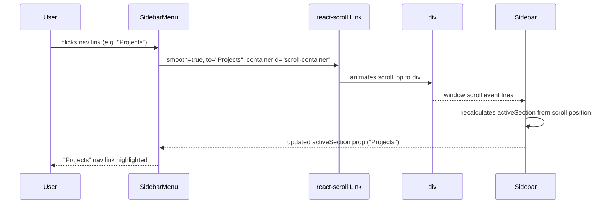

# Page Structure and Navigation

[← Architecture index](index.md)

The portfolio is a single-page application with no URL-based routing. All content lives in one scrollable document; navigation is driven by scroll position. Clicking a sidebar link smooth-scrolls the content area to the target section. No page transitions occur, no browser history entries are pushed, and no `react-router-dom` routes are configured.

## Table of Contents

- [Navigation Model](#navigation-model)
- [Section Registry](#section-registry)
- [Scroll Navigation Sequence](#scroll-navigation-sequence)
- [Active Section Tracking](#active-section-tracking)
- [References](#references)

## Navigation Model

`SidebarMenu` uses react-scroll's `<Link>` component — not `react-router-dom`'s `<Link>` — to scroll to a named DOM `id` inside `div#scroll-container`. The `containerId="scroll-container"` prop scopes the animation to the `main-content` div rather than `window`, which avoids conflicts on mobile where the sidebar and content stack vertically.

`react-router-dom` is listed in `package.json` but is not used in the current source. It was not removed to avoid a potentially breaking change to the CRA build configuration.

## Section Registry

`SidebarMenu` defines its navigation items in the `NAV_ITEMS` constant. Each entry maps a DOM `id` to the i18n key used as the link label. The `Legal` section is intentionally absent from `NAV_ITEMS` — its two sub-sections are accessed via scroll buttons in the sidebar footer, not via the main navigation.

| Section ID | i18n key | App.js wrapper | Notes |
|-----------|---------|----------------|-------|
| `About` | `about` | `div.section#About` | First visible section; active by default on load |
| `Education` | `education` | `div.section#Education` | Static content from i18n locale |
| `Projects` | `projects` | `div.section#Projects` | Data-driven from `projects.json` |
| `RepoDocs` | `repoDocs` | `div.section#RepoDocs` | Data-driven from `projects.json` |
| `Experience` | `experience.jobExperiences` | `div.section#Experience` | Static content from i18n locale |
| `Impressum` | — | inside `div.section#Legal` | Scroll target for `LegalButton`; not in the main nav |
| `Datenschutz` | — | inside `div.section#Legal` | Scroll target for `LegalButton`; not in the main nav |

## Scroll Navigation Sequence

The diagram below traces a navigation click from the sidebar through to the highlighted active link.



The `offset={70}` prop on each `StyledLink` compensates for the mobile top bar height, ensuring the section heading is not obscured after scrolling.

## Active Section Tracking

`Sidebar` recalculates the active section on every scroll event by iterating the `SECTIONS` constant bottom-to-top:

```js
const SECTIONS = ['Legal', 'RepoDocs', 'Experience', 'Projects', 'Education'];
```

It compares `window.scrollY + window.innerHeight / 2` (the viewport midpoint) against each section's `offsetTop`. The first match wins, ensuring the deepest section the user has scrolled past is always highlighted. If no section matches, the fallback is `'About'`.

Iterating bottom-to-top is the key invariant: without it, a user who has scrolled past Projects and into Experience would see Projects highlighted instead of Experience, because Projects appears earlier in a top-to-bottom pass.

## References

- [react-scroll documentation](https://github.com/fisshy/react-scroll)
- [components.md](05b-building-blocks-components.md) — props for `Sidebar` and `SidebarMenu`
- [architecture/data-flow.md](06-runtime.md) — activeSection state ownership
- [architecture/component-tree.md](05-building-blocks.md) — where sidebar components sit in the hierarchy
