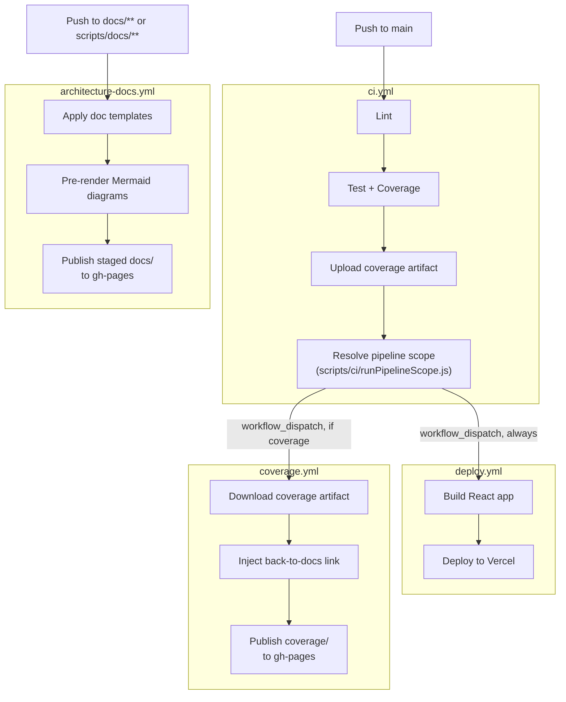

# CI/CD Pipeline

[← Architecture index](index.md)

The portfolio uses four GitHub Actions workflows. `ci.yml` runs first (lint, test, coverage) and, on a successful push to `main`, dispatches `deploy.yml` and `coverage.yml` in parallel — deploy always runs; coverage only runs when a `src/**` change could have altered the report. `architecture-docs.yml` is independent of that chain: it triggers directly on `docs/**` or `scripts/docs/**` pushes. Each of the four workflows has its own concurrency group (see [Concurrency Strategy](#concurrency-strategy)), so `deploy.yml` and `coverage.yml` can genuinely run at the same time instead of queuing behind each other.

`deploy.yml` does not fetch project data — the Projects section renders from the static, hand-curated `src/data/projects.config.js`. The workflow only builds and deploys.

## Table of Contents

- [Pipeline Diagram](#pipeline-diagram)
- [Workflow Files](#workflow-files)
- [Step Details](#step-details)
- [Concurrency Strategy](#concurrency-strategy)
- [Repository Layout: why the root files are at the root](#repository-layout-why-the-root-files-are-at-the-root)
- [Live Verification](#live-verification-2026-07-17)
- [References](#references)

## Pipeline Diagram

## Workflow Files

| File | Trigger | Responsibility |
|------|---------|---------------|
| `.github/workflows/ci.yml` | Push to `main` (`src/**`, `scripts/**`, `config/**`, `package.json`, `vite.config.js`, `index.html`, `.github/workflows/**`), PRs to `main` | Lint, run full test suite, upload coverage artifact; on push, resolve scope and dispatch `deploy.yml` (always) and `coverage.yml` (conditionally) in parallel |
| `.github/workflows/deploy.yml` | Dispatched by `ci.yml`; manual `workflow_dispatch` | Build React app, deploy prebuilt output to Vercel. Does not dispatch anything else. |
| `.github/workflows/coverage.yml` | Dispatched by `ci.yml` when the `coverage` scope flag is true; manual `workflow_dispatch` | Download the coverage artifact from the latest CI run, inject the back-to-docs link into it, and publish it to `gh-pages` under `destination_dir: coverage`. Takes no inputs — dispatching it is the instruction |
| `.github/workflows/architecture-docs.yml` | Push to `docs/**` or `scripts/docs/**`; manual `workflow_dispatch` | Apply HTML templates to Markdown, pre-render Mermaid diagrams, publish a staged copy of `docs/` (excluding `coverage/`) to `gh-pages` |
| `.github/actions/node-setup/` | Composite action used by all four workflows | Sets up Node.js 24, restores the npm cache, and runs `npm ci`; called after `actions/checkout@v7` in each workflow |

## Step Details

### ci.yml

Job `lint-and-test`:
1. Checkout the repository
2. Run the `node-setup` composite action
3. Run `npm run lint` — fails fast before any test runs
4. Run `npm run test:coverage` — all runner configuration lives in `vite.config.js`, so the workflow step carries no flags of its own and cannot drift from a local run
5. Upload `coverage/` as the `coverage-report` artifact (7-day retention)

Job `start-deploy-stage` (push to `main` only; skipped on pull requests):
1. Checkout with `fetch-depth: 0` (full history, required to diff `before`..`sha`)
2. Run `scripts/ci/runPipelineScope.js "$before" "$sha"` — resolves `coverage`/`archDocs`/`deploy` flags from the changed-file list. If the diff range can't be resolved (new branch, force-push), every flag defaults to `true` rather than skipping work.
3. Dispatch `deploy.yml` unconditionally
4. Dispatch `coverage.yml` (no inputs) only when the `coverage` flag is `true` — dispatched immediately after step 3, not waiting for `deploy.yml` to finish, so build/deploy and docs generation run in parallel

### deploy.yml

1. Checkout and `node-setup`
2. Run `npm run build` — production Vite build
3. Run `scripts/prepareVercelOutput.sh` — assemble `.vercel/output/static/`
4. Verify prebuilt static artifacts — confirms `index.html` is present in `.vercel/output/static/`; fails the workflow if missing
5. Deploy with `vercel --prod --prebuilt`
6. Smoke-test the Vercel URL (HTTP 200 required)

### coverage.yml

1. Checkout and `node-setup`
2. Locate the latest successful `ci.yml` run via the `gh` CLI. If none exists (no CI history yet), the download below is skipped and the publish leaves `gh-pages/coverage/` untouched
3. Download the `coverage-report` artifact from that run into `docs/coverage/` (`continue-on-error`: the artifact expires after 7 days)
4. Inject the back-to-docs link via `scripts/ci/injectBackLink.js` — idempotent, and a no-op when the download produced nothing
5. Publish `docs/coverage/` to `gh-pages` under `destination_dir: coverage`
6. Smoke-test `https://keglev.github.io/my-portfolio/coverage/index.html` (warning-only)

### architecture-docs.yml

1. Checkout and `node-setup`
2. Apply doc templates via `scripts/docs/build_docs.js`
3. Pre-render Mermaid diagrams via `scripts/docs/build_mermaid.js`; falls back to CDN client-side rendering when `mmdc` is not installed
4. Stage `docs/` into a temp directory excluding `coverage/` (coverage.yml's territory). A `jsdoc/` exclusion stood beside it until the code reference was retired (ADR-009); nothing generates that directory now
5. Deploy the staged copy to the `gh-pages` branch via `peaceiris/actions-gh-pages@v4` with `keep_files: true`
6. Smoke-test `https://keglev.github.io/my-portfolio` (warning-only)

## Concurrency Strategy

Four separate concurrency groups are in play, deliberately **not** one shared group:

| Group | Scope | Why not shared |
|-------|-------|-----------------|
| `portfolio-pipeline` | `ci.yml` only | — |
| `deploy-pipeline` | `deploy.yml` only | — |
| `coverage-pipeline` | `coverage.yml` only | — |
| `docs-only` | `architecture-docs.yml`'s direct `docs/**` push trigger | — |

`ci.yml`'s `start-deploy-stage` job dispatches `deploy.yml` and `coverage.yml` back to back, while `ci.yml`'s own run is still holding `portfolio-pipeline`. GitHub Actions only protects an **already in-progress** run from cancellation when `cancel-in-progress: false` — a run that is still **queued** is not protected, and is silently cancelled if a second run joins the same group's queue before the first one starts. An earlier version of this pipeline put `deploy.yml` and the coverage workflow (then `api-docs.yml`) in the shared `portfolio-pipeline` group; in practice this meant the docs workflow's queued run cancelled `deploy.yml`'s queued run on every push, so builds silently never reached Vercel. Giving each workflow its own group (`deploy-pipeline`, `coverage-pipeline`) removes the race and lets them run in parallel, at the cost of `ci.yml` runs no longer queuing behind `deploy.yml`/`coverage.yml` runs — accepted deliberately, since `ci.yml` never touches Vercel or `gh-pages` and each of the other two workflows still self-serializes within its own group.

Docs-only pushes — changes to `docs/**` or `scripts/docs/**` — trigger `architecture-docs.yml` directly using the separate `docs-only` concurrency group, so small documentation edits don't queue behind any of the portfolio-pipeline/deploy-pipeline/coverage-pipeline lineage.

`coverage.yml` and `architecture-docs.yml` publish to the same `gh-pages` branch from independent trigger paths and could in principle run concurrently. Both declare a job-level `gh-pages-deploy` concurrency group (matched by name across workflows), which serializes just their publish jobs without changing either workflow's top-level trigger concurrency.

## Repository Layout: why the root files are at the root

A repository root fills up with config files, and the honest question about
each is whether it is there because a tool demands it or because nobody moved
it. Every tracked root file in this project is in the first category — each
line below names the tool that requires the location.

This note lives in the deployment chapter rather than the README because
almost every answer is "a build or deploy tool resolves it from here", which
is this chapter's subject. Putting it in the README would also duplicate the
docs site, which the README deliberately does not do.

| File | Why it is at the root |
|---|---|
| `package.json`, `package-lock.json` | npm resolves the project manifest and lockfile from the directory it runs in; `npm ci` reads both. |
| `vite.config.js` | Vite's default config lookup. Moving it needs `--config` on every invocation, including the ones inside CI. |
| `index.html` | Vite's build entry, not a static asset — it is the module graph's root, and `root: '.'` in the config points at this directory (it lived in `public/` under Create React App). |
| `vercel.json` | Vercel reads project configuration from the repository root only. |
| `.vercelignore` | Same: root-only, by the platform's convention. |
| `eslint.config.mjs` | ESLint 9 flat config searches upward from the working directory; the root is where the search ends. |
| `jsconfig.json` | Editors resolve it from the project root to type-check and offer completions across `src`, `scripts`, and `config`. Never read by the build. |
| `.gitignore` | Applies repository-wide from the root. |
| `.env.example` | Documents the `.env` that Vite loads, and Vite loads `.env` from the project root. Keeping the template beside the real file is the point. |
| `README.md` | GitHub renders the root README on the repository page. |
| `LICENSE` | GitHub's licence detection reads the root. |

Nothing under `src/`, `scripts/`, `config/`, or `docs/` is here for a reason
other than the above. Directories that look like they could be root files
(`config/vitest/`, `scripts/ci/`, `scripts/docs/`) are deliberately nested,
because nothing requires them at the root and grouping them by purpose keeps
the root readable.

## Live Verification (2026-07-17)

The four-workflow topology above was verified live against production, not just read from the workflow files.

| # | Scenario | Expected | Result |
|---|----------|----------|--------|
| 1 | src-only push | `lint-and-test` → `deploy.yml` + `coverage.yml` in parallel; `architecture-docs.yml` skipped | Pass |
| 2 | test-only push | `deploy.yml` + coverage publish; `architecture-docs.yml` skipped | Pass |
| 3 | `docs/**`-only push | Only `architecture-docs.yml` runs; `ci.yml` doesn't trigger | Pass |
| 4 | gh-pages content | `/coverage/`, architecture pages, and root all reachable | Pass |

Two bugs were found and fixed during this verification, both now on `main`:

- Shared `portfolio-pipeline` concurrency group across `ci.yml`, `deploy.yml`, and the docs workflow (then `api-docs.yml`, now `coverage.yml`) caused `deploy.yml`'s queued run to be silently cancelled on every push — no Vercel deploy actually went out until this was fixed (see [Concurrency Strategy](#concurrency-strategy) above for the root cause).
- An edit that expanded `deploy.yml`'s concurrency-group header comment accidentally deleted its `name:` and `on:` keys, leaving the workflow with no trigger.

## References

- [GitHub Actions documentation](https://docs.github.com/en/actions)
- [Vercel CLI documentation](https://vercel.com/docs/cli)
- [peaceiris/actions-gh-pages](https://github.com/peaceiris/actions-gh-pages)
- [DEPLOY.md](07b-deployment-configuration.md) — Vercel environment variables and deployment details
- [TESTS.md](08c-concepts-testing.md) — test runner configuration and coverage thresholds
