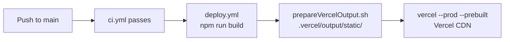

# Deployment

[← Architecture index](index.md)

This project deploys the React app to Vercel (live site). The Projects section is static, hand-curated content in `src/data/projects.config.js` — there is no data-fetch step before the build. The documentation site and the test coverage report are published separately to GitHub Pages via the `gh-pages` branch.

## Contents

- [Deployment targets](#deployment-targets)
- [Environment variables](#environment-variables)
- [Deploying to Vercel](#deploying-to-vercel)
- [Running locally](#running-locally)
- [Build artifacts](#build-artifacts)
- [Security](#security)
- [Troubleshooting](#troubleshooting)
- [References](#references)

## Deployment targets

| Target | URL | Trigger | Branch |
|--------|-----|---------|--------|
| Vercel (live site) | https://carloskeglevich.de | Push to main | main |
| GitHub Pages (docs site) | https://keglev.github.io/my-portfolio/ | Workflow dispatch | gh-pages |

`carloskeglevich.de` is the site. The apex redirects (308) to the `www` host, and Vercel's generated `*.vercel.app` deployment URL still resolves — both are hosting details, not addresses to publish. `deploy.yml`'s smoke test follows the redirect and checks the custom domain, so a healthy build behind broken DNS fails the deploy instead of passing it.

## Environment variables

The build consumes exactly one application secret: `VITE_WEB3FORMS_KEY`, the Web3Forms access key for the contact form. It is read at build time as `import.meta.env.VITE_WEB3FORMS_KEY` and baked into the bundle, so it must be present in the GitHub Actions environment before `npm run build` — `deploy.yml` fails fast if it is unset rather than shipping a form that silently delivers nothing. The `VITE_` prefix is required: Vite exposes only prefixed variables to client code.

"Public access key" is accurate rather than careless. Web3Forms keys are designed to be visible in client-side bundles; this one lives in Actions secrets to keep it out of git history, not because exposure would be a breach.

Separately, the `VERCEL_TOKEN`/`VERCEL_ORG_ID`/`VERCEL_PROJECT_ID` triple is deploy-time only — used by the Vercel CLI to upload the prebuilt artifact, never read by the build. See [Context](03-context.md) for the full input table, including the GitHub personal access token that this pipeline no longer uses at all.

## Deploying to Vercel

Deployment runs through GitHub Actions using a prebuilt artifact. Vercel does not run the build itself — GitHub Actions builds the app and hands Vercel a ready-to-serve `.vercel/output/` directory.

A `vercel.json` in the project root configures three fields: `github.productionBranch: "main"` anchors any Vercel GitHub integration to the `main` branch (preventing the `gh-pages` documentation branch from being treated as a production source), and `buildCommand: "vite build"` with `outputDirectory: "dist"` records the correct build command and output location. The `buildCommand` is never invoked in practice because `vercel --prod --prebuilt` delivers a finished artifact and Vercel performs no build step. `ignoreCommand` skips Vercel's own git-integration auto-build whenever the pushed ref is `gh-pages` (exit 0 = skip): that branch only carries generated docs output, never app code, so a Vercel build triggered by it would be wasted work — the app only ever deploys from `main`, via `deploy.yml`'s prebuilt-artifact path above.

1. Connect the GitHub repository to a Vercel project and record `VERCEL_TOKEN`, `VERCEL_ORG_ID`, and `VERCEL_PROJECT_ID` as GitHub Actions secrets (first-time setup only).
2. Push to `main` — `ci.yml` detects the push, runs linting and tests, then dispatches `deploy.yml`.
3. `deploy.yml` runs `npm run build` and assembles the prebuilt artifact in `.vercel/output/static/` via `scripts/prepareVercelOutput.sh`.
4. GitHub Actions deploys the prebuilt artifact to Vercel via `vercel --prod --prebuilt`.



## Running locally

Use these steps to preview a prebuilt Vercel output before committing or deploying.

1. Run the React build:

```powershell
npm run build
```

2. Optionally prepare and deploy a prebuilt Vercel output:

```powershell
Remove-Item -Recurse -Force .vercel\output -ErrorAction SilentlyContinue
New-Item -ItemType Directory -Force .vercel\output\static | Out-Null
Copy-Item -Path dist\* -Destination .vercel\output\static -Recurse -Force

@"
{
  "version": 3,
  "routes": [
    { "handle": "filesystem" },
    { "src": "/(.*)", "dest": "/index.html" }
  ]
}
"@ | Out-File -FilePath .vercel\output\config.json -Encoding utf8

npx vercel --prebuilt . --token $env:VERCEL_TOKEN --yes
```

## Build artifacts

`dist/` (the Vite production bundle) is generated by `npm run build` and is intentionally excluded from version control. CI regenerates it on every build.

## Security

- Do not commit tokens to source control — store them in GitHub Actions secrets.

## Troubleshooting

- **Missing `index.html` in prebuilt output** — confirm `npm run build` completed successfully before `prepareVercelOutput.sh` runs.

## References

- [Vercel documentation](https://vercel.com/docs)
- [GitHub Pages documentation](https://docs.github.com/en/pages)
- [Vite — environment variables and modes](https://vite.dev/guide/env-and-mode)
