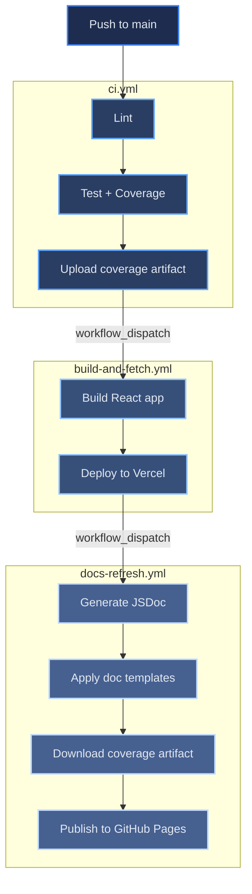

# CI/CD Pipeline

[← Architecture index](index.md)

The portfolio uses three GitHub Actions workflows that form a sequential pipeline: CI runs first, build-and-fetch builds and deploys the app to Vercel, and docs-refresh publishes documentation to GitHub Pages. A shared concurrency group ensures no two pipeline runs overlap.

Despite its name, `build-and-fetch.yml` no longer fetches project data — the Projects section renders from the static, hand-curated `src/data/projects.config.js`. The workflow only builds and deploys.

## Table of Contents

- [Pipeline Diagram](#pipeline-diagram)
- [Workflow Files](#workflow-files)
- [Step Details](#step-details)
- [Concurrency Strategy](#concurrency-strategy)
- [References](#references)

## Pipeline Diagram

## Workflow Files

| File | Trigger | Responsibility |
|------|---------|---------------|
| `.github/workflows/ci.yml` | Push to `main` (`src/**`, `scripts/**`, `config/**`, `jest.node.config.js`, `package.json`, `.github/workflows/ci.yml`), PRs to `main` | Lint, run full test suite, upload coverage artifact; dispatches `build-and-fetch.yml` on successful push |
| `.github/workflows/build-and-fetch.yml` | Dispatched by `ci.yml` after tests pass; manual `workflow_dispatch` | Build React app, deploy prebuilt output to Vercel, dispatch `docs-refresh.yml` |
| `.github/workflows/docs-refresh.yml` | Dispatched by `build-and-fetch.yml`; push to `docs/**` or `scripts/docs/**`; manual `workflow_dispatch` | Apply HTML templates to Markdown, pre-render Mermaid diagrams, generate JSDoc, download coverage artifact from latest CI run, publish `docs/` to `gh-pages` |
| `.github/actions/node-setup/` | Composite action used by all three workflows | Sets up Node.js 20, restores the npm cache, and runs `npm ci --legacy-peer-deps`; called after `actions/checkout@v4` in each workflow |

## Step Details

### ci.yml

1. Checkout the repository
2. Run the `node-setup` composite action
3. Run `npm run lint` — fails fast before any test runs
4. Run `npx jest --config=jest.node.config.js --runInBand --coverage` — serial execution prevents resource contention in CI
5. Upload `coverage/` as the `coverage-report` artifact (7-day retention)
6. Dispatch `build-and-fetch.yml` (push to `main` only; skipped on pull requests)

### build-and-fetch.yml

1. Checkout and `node-setup`
2. Run `npm run build` — production CRA build
3. Run `scripts/prepareVercelOutput.sh` — assemble `.vercel/output/static/`
4. Verify prebuilt static artifacts — confirms `index.html` is present in `.vercel/output/static/`; fails the workflow if missing
5. Deploy with `vercel --prod --prebuilt`
6. Smoke-test the Vercel URL (HTTP 200 required before proceeding)
7. Dispatch `docs-refresh.yml`

### docs-refresh.yml

1. Checkout and `node-setup`
2. Apply doc templates via `scripts/docs/build_docs.js`
3. Pre-render Mermaid diagrams via `scripts/docs/build_mermaid.js`; falls back to CDN client-side rendering when `mmdc` is not installed
4. Generate JSDoc API docs with `npm run docs:jsdoc`
5. Locate the latest successful `ci.yml` run via the `gh` CLI
6. Download the `coverage-report` artifact from that run
7. Copy `coverage/` into `docs/coverage/`
8. Deploy `docs/` to the `gh-pages` branch via `peaceiris/actions-gh-pages@v4`
9. Smoke-test `https://keglev.github.io/my-portfolio` (warning-only; workflow exits 0 regardless)

## Concurrency Strategy

All three workflows share the `portfolio-pipeline` concurrency group with `cancel-in-progress: false`. Runs queue rather than cancel, so a second push waits for the first full pipeline to complete.

Docs-only pushes — changes to `docs/**` or `scripts/docs/**` — trigger `docs-refresh.yml` directly using the separate `docs-only` concurrency group. This keeps small documentation edits fast without queuing behind an active full-pipeline run.

## References

- [GitHub Actions documentation](https://docs.github.com/en/actions)
- [Vercel CLI documentation](https://vercel.com/docs/cli)
- [peaceiris/actions-gh-pages](https://github.com/peaceiris/actions-gh-pages)
- [DEPLOY.md](../DEPLOY.md) — Vercel environment variables and deployment details
- [TESTS.md](../TESTS.md) — test runner configuration and coverage thresholds
