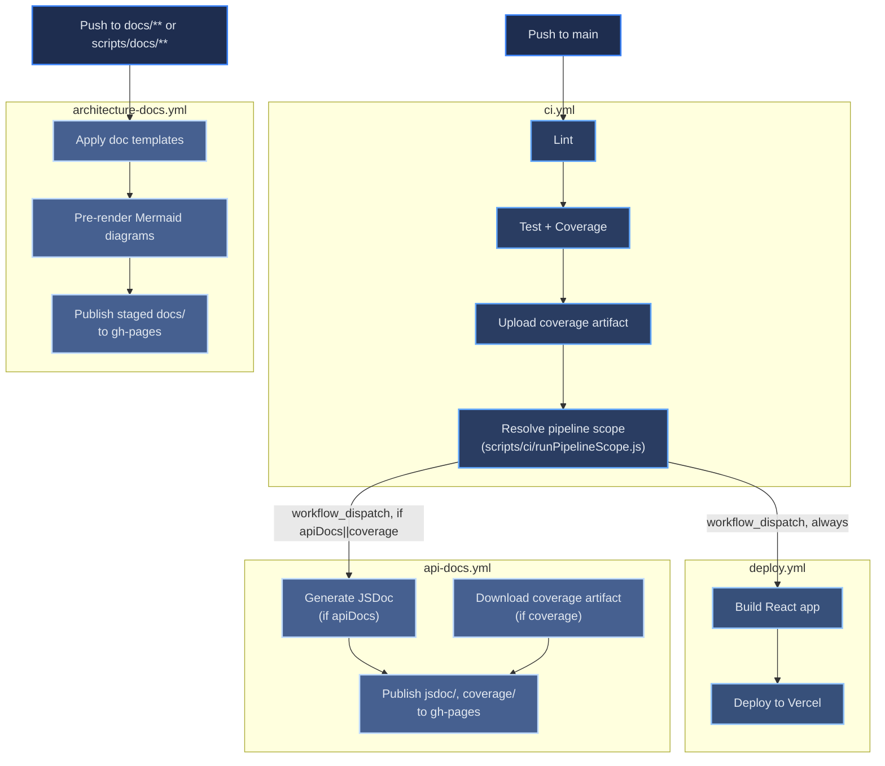

# CI/CD Pipeline

[← Architecture index](index.md)

The portfolio uses four GitHub Actions workflows. `ci.yml` runs first (lint, test, coverage) and, on a successful push to `main`, dispatches `deploy.yml` and `api-docs.yml` in parallel — deploy always runs; api-docs only runs when the changed files could affect the API surface or test coverage. `architecture-docs.yml` is independent of that chain: it triggers directly on `docs/**` or `scripts/docs/**` pushes. Each of the four workflows has its own concurrency group (see [Concurrency Strategy](#concurrency-strategy)), so `deploy.yml` and `api-docs.yml` can genuinely run at the same time instead of queuing behind each other.

`deploy.yml` does not fetch project data — the Projects section renders from the static, hand-curated `src/data/projects.config.js`. The workflow only builds and deploys.

## Table of Contents

- [Pipeline Diagram](#pipeline-diagram)
- [Workflow Files](#workflow-files)
- [Step Details](#step-details)
- [Concurrency Strategy](#concurrency-strategy)
- [References](#references)

## Pipeline Diagram

## Workflow Files

| File | Trigger | Responsibility |
|------|---------|---------------|
| `.github/workflows/ci.yml` | Push to `main` (`src/**`, `scripts/**`, `config/**`, `jest.node.config.js`, `package.json`, `.github/workflows/**`), PRs to `main` | Lint, run full test suite, upload coverage artifact; on push, resolve scope and dispatch `deploy.yml` (always) and `api-docs.yml` (conditionally) in parallel |
| `.github/workflows/deploy.yml` | Dispatched by `ci.yml`; manual `workflow_dispatch` | Build React app, deploy prebuilt output to Vercel. Does not dispatch anything else. |
| `.github/workflows/api-docs.yml` | Dispatched by `ci.yml` with `apiDocs`/`coverage` inputs; manual `workflow_dispatch` (defaults both inputs to true) | Generate JSDoc (if `apiDocs`), download the coverage artifact from the latest CI run and publish it (if `coverage`); publishes `jsdoc/` and `coverage/` to `gh-pages` via separate `destination_dir` scoped steps |
| `.github/workflows/architecture-docs.yml` | Push to `docs/**` or `scripts/docs/**`; manual `workflow_dispatch` | Apply HTML templates to Markdown, pre-render Mermaid diagrams, publish a staged copy of `docs/` (excluding `jsdoc/` and `coverage/`) to `gh-pages` |
| `.github/actions/node-setup/` | Composite action used by all four workflows | Sets up Node.js 22, restores the npm cache, and runs `npm ci --legacy-peer-deps`; called after `actions/checkout@v4` in each workflow |

## Step Details

### ci.yml

Job `lint-and-test`:
1. Checkout the repository
2. Run the `node-setup` composite action
3. Run `npm run lint` — fails fast before any test runs
4. Run `npx jest --config=jest.node.config.js --runInBand --coverage` — serial execution prevents resource contention in CI
5. Upload `coverage/` as the `coverage-report` artifact (7-day retention)

Job `start-deploy-stage` (push to `main` only; skipped on pull requests):
1. Checkout with `fetch-depth: 0` (full history, required to diff `before`..`sha`)
2. Run `scripts/ci/runPipelineScope.js "$before" "$sha"` — resolves `apiDocs`/`coverage`/`archDocs`/`deploy` flags from the changed-file list. If the diff range can't be resolved (new branch, force-push), every flag defaults to `true` rather than skipping work.
3. Dispatch `deploy.yml` unconditionally
4. Dispatch `api-docs.yml` (with `apiDocs`/`coverage` inputs) only when at least one of those flags is `true` — dispatched immediately after step 3, not waiting for `deploy.yml` to finish, so build/deploy and docs generation run in parallel

### deploy.yml

1. Checkout and `node-setup`
2. Run `npm run build` — production CRA build
3. Run `scripts/prepareVercelOutput.sh` — assemble `.vercel/output/static/`
4. Verify prebuilt static artifacts — confirms `index.html` is present in `.vercel/output/static/`; fails the workflow if missing
5. Deploy with `vercel --prod --prebuilt`
6. Smoke-test the Vercel URL (HTTP 200 required)

### api-docs.yml

1. Checkout and `node-setup`
2. Generate JSDoc API docs with `npm run docs:jsdoc` (skipped if `apiDocs` input is `false`)
3. Locate the latest successful `ci.yml` run via the `gh` CLI (skipped if `coverage` input is `false`)
4. Download the `coverage-report` artifact from that run into `docs/coverage/`
5. Publish `docs/jsdoc/` to `gh-pages` under `destination_dir: jsdoc` (skipped if `apiDocs` is `false`)
6. Publish `docs/coverage/` to `gh-pages` under `destination_dir: coverage` (skipped if `coverage` is `false`)
7. Smoke-test `https://keglev.github.io/my-portfolio/jsdoc/index.html` (warning-only)

### architecture-docs.yml

1. Checkout and `node-setup`
2. Apply doc templates via `scripts/docs/build_docs.js`
3. Pre-render Mermaid diagrams via `scripts/docs/build_mermaid.js`; falls back to CDN client-side rendering when `mmdc` is not installed
4. Stage `docs/` into a temp directory excluding `jsdoc/` and `coverage/` (those are api-docs.yml's territory; `docs/jsdoc/*.html` is also git-tracked on `main` as legacy generated output, so publishing `./docs` unfiltered would overwrite api-docs.yml's fresher `gh-pages/jsdoc/` with stale committed snapshots)
5. Deploy the staged copy to the `gh-pages` branch via `peaceiris/actions-gh-pages@v4` with `keep_files: true`
6. Smoke-test `https://keglev.github.io/my-portfolio` (warning-only)

## Concurrency Strategy

Four separate concurrency groups are in play, deliberately **not** one shared group:

| Group | Scope | Why not shared |
|-------|-------|-----------------|
| `portfolio-pipeline` | `ci.yml` only | — |
| `deploy-pipeline` | `deploy.yml` only | — |
| `api-docs-pipeline` | `api-docs.yml` only | — |
| `docs-only` | `architecture-docs.yml`'s direct `docs/**` push trigger | — |

`ci.yml`'s `start-deploy-stage` job dispatches `deploy.yml` and `api-docs.yml` back to back, while `ci.yml`'s own run is still holding `portfolio-pipeline`. GitHub Actions only protects an **already in-progress** run from cancellation when `cancel-in-progress: false` — a run that is still **queued** is not protected, and is silently cancelled if a second run joins the same group's queue before the first one starts. An earlier version of this pipeline put `deploy.yml` and `api-docs.yml` in the shared `portfolio-pipeline` group; in practice this meant `api-docs.yml`'s queued run cancelled `deploy.yml`'s queued run on every push, so builds silently never reached Vercel. Giving each workflow its own group (`deploy-pipeline`, `api-docs-pipeline`) removes the race and lets them run in parallel, at the cost of `ci.yml` runs no longer queuing behind `deploy.yml`/`api-docs.yml` runs — accepted deliberately, since `ci.yml` never touches Vercel or `gh-pages` and each of the other two workflows still self-serializes within its own group.

Docs-only pushes — changes to `docs/**` or `scripts/docs/**` — trigger `architecture-docs.yml` directly using the separate `docs-only` concurrency group, so small documentation edits don't queue behind any of the portfolio-pipeline/deploy-pipeline/api-docs-pipeline lineage.

`api-docs.yml` and `architecture-docs.yml` publish to the same `gh-pages` branch from independent trigger paths and could in principle run concurrently. Both declare a job-level `gh-pages-deploy` concurrency group (matched by name across workflows), which serializes just their publish jobs without changing either workflow's top-level trigger concurrency.

## References

- [GitHub Actions documentation](https://docs.github.com/en/actions)
- [Vercel CLI documentation](https://vercel.com/docs/cli)
- [peaceiris/actions-gh-pages](https://github.com/peaceiris/actions-gh-pages)
- [DEPLOY.md](../DEPLOY.md) — Vercel environment variables and deployment details
- [TESTS.md](../TESTS.md) — test runner configuration and coverage thresholds
