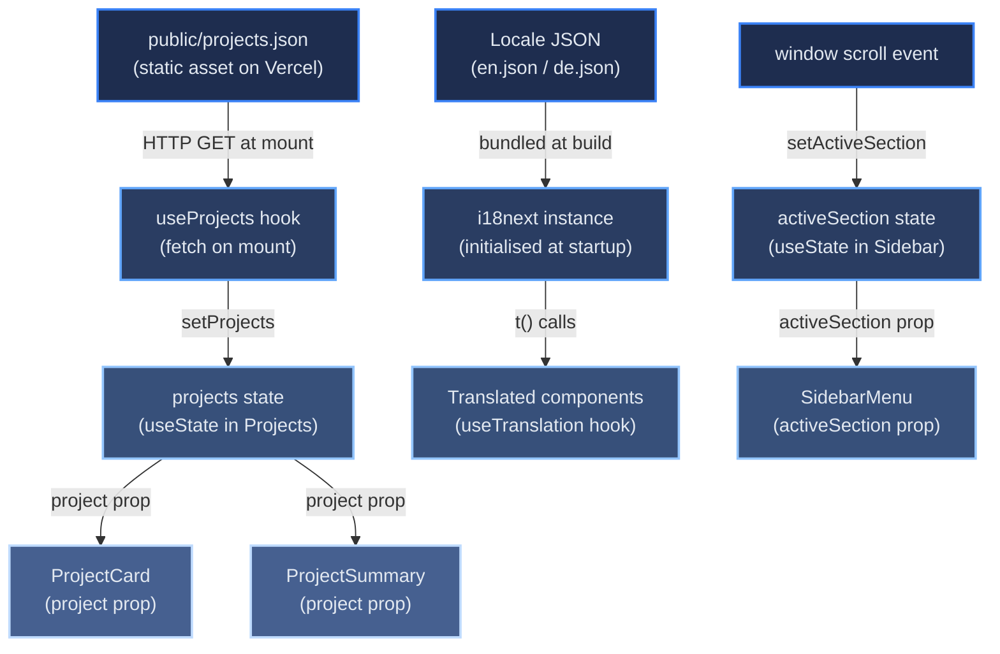

# Data Flow

[← Architecture index](index.md)

This document explains how data moves through the portfolio at build time and at runtime, and describes the state management approach.

## Table of Contents

- [Build-Time Data Preparation](#build-time-data-preparation)
- [Runtime Data Flow](#runtime-data-flow)
- [State Management Approach](#state-management-approach)
- [References](#references)

## Build-Time Data Preparation

Before the React bundle is served, GitHub Actions runs `scripts/fetchProjects.js` to fetch pinned repository metadata via the GitHub GraphQL API. The output — `public/projects.json` and `public/projects_media/` — is bundled into the Vercel deployment as static assets. Every project card and documentation link in the live site originates from this pre-generation step; there are no runtime calls to the GitHub API.

## Runtime Data Flow

The diagram below shows the principal data flows during a user session. Arrows represent data movement; node labels identify the source or consumer.

## State Management Approach

The app uses no global state management library such as Redux, Zustand, or MobX. State is owned by the component that needs it and passed down as props where children require it. This was a deliberate choice: the portfolio has no cross-component shared mutable state that would justify the overhead of a centralised store.

| State | Owner | Shared via |
|-------|-------|-----------|
| Project list (fetch lifecycle) | `useProjects` hook → `Projects` | Props to `ProjectCard`, `ProjectSummary` |
| Active nav section | `Sidebar` | Prop to `SidebarMenu` |
| Current language | i18next module instance | `react-i18next` context (not component state) |
| Legal / nav scroll targets | No state — DOM `getElementById` calls | — |

Language selection is the one exception to pure component state: i18next maintains the current locale in its own module-level instance. All components subscribe to locale changes via the `useTranslation()` hook, which internally consumes the React context provided automatically by `initReactI18next`.

## References

- [React useState documentation](https://react.dev/reference/react/useState)
- [i18next changeLanguage API](https://www.i18next.com/overview/api#changelanguage)
- [component-tree.md](component-tree.md) — where each stateful component sits in the hierarchy
- [i18n-flow.md](i18n-flow.md) — language-switch sequence in detail
