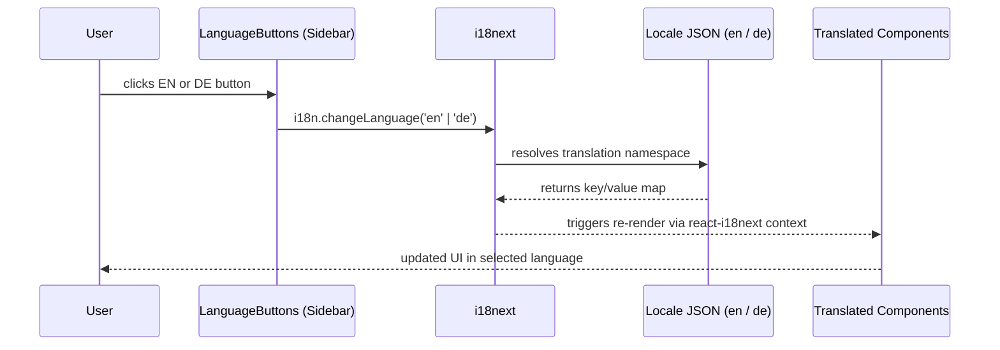

# Internationalisation Flow

[← Architecture index](index.md)

This document describes how the portfolio handles language switching between English and German. The implementation uses i18next and react-i18next with a single `translation` namespace and JSON locale files bundled into the JavaScript build at compile time.

## Table of Contents

- [Language Switch Sequence](#language-switch-sequence)
- [Namespaces and Keys](#namespaces-and-keys)
- [Configuration Details](#configuration-details)
- [References](#references)

## Language Switch Sequence

The sequence below traces what happens from the moment the user clicks a language button to the point where the updated UI renders.

Because both locale files are imported directly in `src/i18n.js` and bundled at build time, there is no network request on language switch. The transition is synchronous.

## Namespaces and Keys

The app uses a single i18next namespace — `translation`, the default — containing all translatable strings. The table below lists the top-level key groups, the UI area they cover, and the files that define them.

| Key group | UI area covered | Source files |
|-----------|----------------|-------------|
| `name`, `title` | Name and job title in the sidebar | src/locales/en.json, src/locales/de.json |
| `about`, `aboutSection` | Section heading and bio paragraphs | src/locales/en.json, src/locales/de.json |
| `education`, `educationSection` | Education section heading and degree entries | src/locales/en.json, src/locales/de.json |
| `projects`, `repoDocs` | Projects and documentation section headings | src/locales/en.json, src/locales/de.json |
| `experience`, `experienceSection` | Experience section heading and job entries | src/locales/en.json, src/locales/de.json |
| `legal` | Impressum and Datenschutz headings and HTML content | src/locales/en.json, src/locales/de.json |
| `language` | EN / DE toggle button labels | src/locales/en.json, src/locales/de.json |
| `footerMessage`, `impressumLink`, `datenschutzLink` | Sidebar footer text and legal navigation buttons | src/locales/en.json, src/locales/de.json |
| `viewOnGithub`, `viewDocs`, `urlLabel`, `noRepoDocs` | Project card action labels | src/locales/en.json, src/locales/de.json |

## Configuration Details

The i18next instance is configured in `src/i18n.js` and imported by `src/index.js` before any translated component mounts. All components access translations via the `useTranslation()` hook: `const { t } = useTranslation()`.

| Setting | Value | Reason |
|---------|-------|--------|
| `lng` | `'de'` | Portfolio targets a German-speaking job market; German is the default experience |
| `fallbackLng` | `'en'` | Falls back to English if a key is missing from the German locale file |
| `interpolation.escapeValue` | `false` | React already escapes interpolated values; disabling prevents double-escaping |
| `compatibilityJSON` | `'v3'` | Matches the plural-key format used in the locale JSON files |
| Namespace | `translation` (default) | A single namespace is sufficient; splitting would add configuration overhead without benefit |

## References

- [i18next documentation](https://www.i18next.com)
- [react-i18next documentation](https://react.i18next.com)
- [i18next configuration options](https://www.i18next.com/overview/configuration-options)
- [component-tree.md](component-tree.md) — where the language buttons live in the component hierarchy
