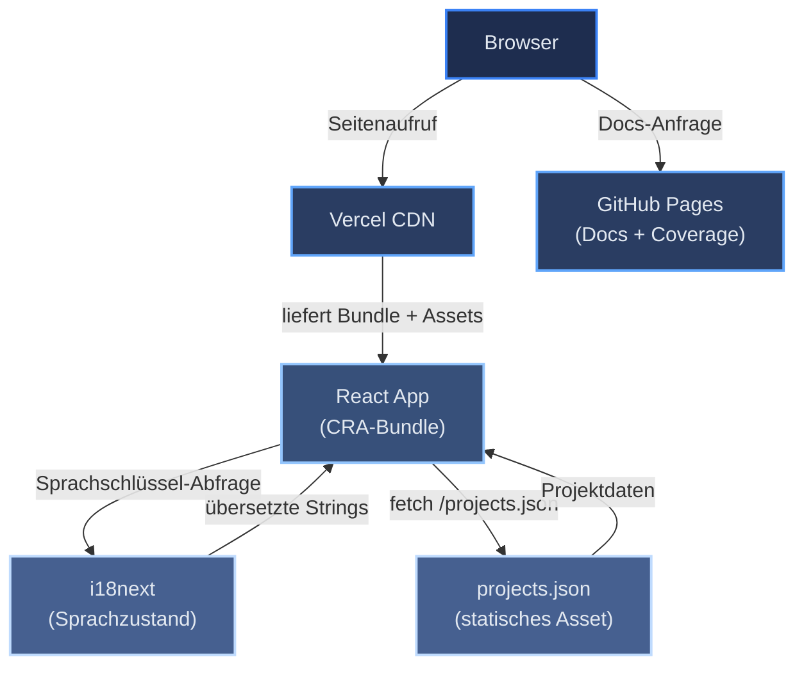

# Portfolio-Architektur – Übersicht

[← Architekturindex](index.md)

Dieses persönliche Portfolio ist eine Single-Page-Anwendung, erstellt mit React (Create React App). Es präsentiert berufliche Informationen — Erfahrung, Ausbildung, Projekte und rechtliche Hinweise — auf Englisch und Deutsch. Die Projektdaten werden zur Build-Zeit durch Abruf gepinnter GitHub-Repositories über die GitHub GraphQL API vorausgeneriert und als statisches JSON gespeichert, sodass keine Laufzeit-API-Abhängigkeit besteht. Die gebaute App wird auf Vercel bereitgestellt; generierte Dokumentation und Test-Coverage-Berichte werden separat auf GitHub Pages veröffentlicht.

## Inhaltsverzeichnis

- [Tech-Stack](#tech-stack)
- [Komponentendiagramm](#komponentendiagramm)
- [Wichtige Designentscheidungen](#wichtige-designentscheidungen)
- [Nichtfunktionale Anforderungen](#nichtfunktionale-anforderungen)
- [Referenzen](#referenzen)

## Tech-Stack

Die folgende Tabelle ordnet jede Architekturebene der gewählten Technologie und dem Grund für die Wahl zu.

| Ebene | Technologie | Begründung |
|-------|-------------|-----------|
| UI-Framework | React 18 (Create React App) | Ausgereiftes Ökosystem; CRA bietet Zero-Config-Build-Tooling |
| Styling | styled-components 6 | Komponentenlokale Styles, keine Class-Name-Kollisionen |
| Routing / Scroll | react-router-dom 6, react-scroll | Hash-basierte Navigation mit sanftem Scrollen; kein Server erforderlich |
| Internationalisierung | i18next 25 + react-i18next 14 | Industriestandard-i18n, React-Hooks-API, JSON-Namespace-Unterstützung |
| HTTP-Client | axios 1 | Konsistente API für GitHub-API-Aufrufe in allen Umgebungen |
| Analytics | Vercel Speed Insights | Zero-Config Core Web Vitals-Monitoring; ohne Cookies |
| Testing | Jest + React Testing Library | Komponentenbasierte Unit-Tests, am Nutzerverhalten ausgerichtet |
| Linting | ESLint (react-app-Konfiguration) | Fehler vor CI abfangen; keine zusätzliche Konfiguration nötig |
| CI/CD | GitHub Actions (3 Workflows) | Kostenlos für öffentliche Repos, native GitHub-Integration |
| App-Hosting | Vercel | Automatisches HTTPS, Edge-CDN, Prebuilt-Artifact-Deployment |
| Docs-Hosting | GitHub Pages (gh-pages-Branch) | Kostenloses statisches Hosting, zusammen mit dem Repository |

## Komponentendiagramm

Das folgende Diagramm zeigt den Laufzeitfluss von einer Browser-Anfrage durch die bereitgestellte Infrastruktur.

## Wichtige Designentscheidungen

Jede Entscheidung unten verweist auf das Dokument, in dem sie ausführlich erläutert wird.

- **Statische Datenvorgenerierung** — Projektdaten werden zur Build-Zeit von GitHub abgerufen, nicht zur Laufzeit, sodass keine API-Abhängigkeit im Live-Betrieb besteht. Siehe [REFRESH.md](../REFRESH.md).
- **Vercel Prebuilt Artifact** — Die App wird in GitHub Actions gebaut und als `.vercel/output`-Artifact deployed, was vollständige Kontrolle über die Build-Umgebung gibt. Siehe [DEPLOY.md](../DEPLOY.md).
- **Zwei Test-Runner** — Node-only-Skripte verwenden eine separate Jest-Konfiguration vom CRA-Runner, um Babel/CSS-Transform-Konflikte zu vermeiden. Siehe [TESTS.md](../TESTS.md).
- **Standard-Locale Deutsch** — `lng: 'de'` in i18next, da das Portfolio auf einen deutschsprachigen Jobmarkt ausgerichtet ist. Siehe [i18n-flow.md](i18n-flow.md).
- **Keine Client-seitige State-Bibliothek** — Komponentenlokales `useState` ist ausreichend; es gibt keinen gemeinsamen veränderbaren Zustand zwischen unverbundenen Komponenten. Siehe [data-flow.md](data-flow.md).

## Nichtfunktionale Anforderungen

| Anforderung | Ansatz |
|-------------|--------|
| Performance | Statisches JSON vom Vercel CDN; keine Laufzeit-API-Aufrufe; Speed Insights überwacht Core Web Vitals |
| Barrierefreiheit | Semantische HTML-Section-Anker; `aria-label` auf Icon-only-Buttons; tastaturnavigierbare Sidebar |
| Internationalisierung | Vollständige EN/DE-Unterstützung via i18next; Standard-Locale Deutsch; alle sichtbaren Strings in Locale-JSON-Dateien |
| Zuverlässigkeit | `ErrorBoundary` umschließt den gesamten React-Baum; CI blockiert Deployment bei Test- oder Lint-Fehlern |
| Wartbarkeit | Generierte Docs und Coverage werden bei jedem erfolgreichen Deployment auf GitHub Pages veröffentlicht |

## Referenzen

- [React-Dokumentation](https://react.dev)
- [i18next-Dokumentation](https://www.i18next.com)
- [Vercel-Dokumentation](https://vercel.com/docs)
- [Create React App Dokumentation](https://create-react-app.dev)
- [GitHub Actions Dokumentation](https://docs.github.com/en/actions)
