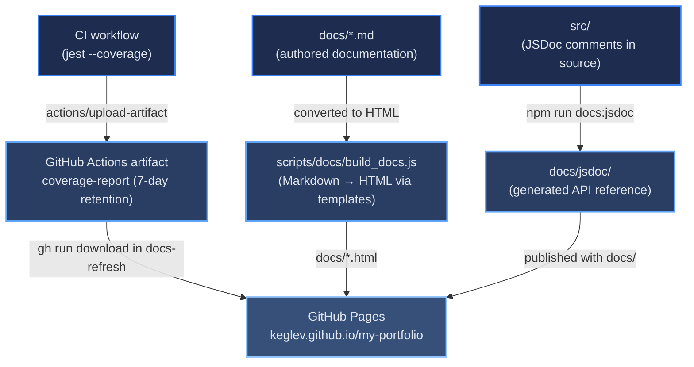

# Deployment Data Flow

[← Documentation root](../index.md)

This document shows how data moves through the deployment system — from external APIs and repository secrets through build-time scripts to the final deployment targets on Vercel and GitHub Pages. For configuration details (environment variables, step-by-step commands), see [DEPLOY.md](../DEPLOY.md). For the CI/CD workflow trigger chain, see [architecture/ci-cd-pipeline.md](../architecture/ci-cd-pipeline.md).

## Table of Contents

- [Configuration Inputs](#configuration-inputs)
- [Documentation and Coverage Flow](#documentation-and-coverage-flow)
- [Artifact Summary](#artifact-summary)
- [References](#references)

## Configuration Inputs

Before the build pipeline can deploy, one category of external input must be available as environment variables in the GitHub Actions runner.

| Input | Provided by | Consumed by | Required |
|-------|------------|-------------|----------|
| `VERCEL_TOKEN`, `VERCEL_ORG_ID`, `VERCEL_PROJECT_ID` | GitHub repository secrets | Vercel CLI deploy step | Yes |
| `GITHUB_TOKEN` | Automatically injected by Actions | `gh` CLI calls in all three workflows | Yes (automatic) |

The Projects section is static, hand-curated content in `src/data/projects.config.js` — there is no GitHub API or translation API call at build time, so no corresponding secrets are needed.

## Documentation and Coverage Flow

The diagram below shows how documentation sources and the test coverage report flow into GitHub Pages independently of the Vercel deployment.

The `docs-refresh.yml` workflow is responsible for the entire right side of this diagram. It is triggered after a successful Vercel deployment (dispatched by `build-and-fetch.yml`) and also directly on pushes to `docs/**` or `scripts/docs/**`, which lets small documentation edits publish without running the full pipeline.

## Artifact Summary

The table below lists every intermediate and final artifact produced by the deployment system, where it originates, and where it lands.

| Artifact | Produced by | Stage | Destination |
|----------|------------|-------|-------------|
| `build/` | `npm run build` (CRA) | Build-time | Merged into `.vercel/output/static/` |
| `.vercel/output/static/` | `scripts/prepareVercelOutput.sh` | Pre-deploy | Deployed to Vercel CDN |
| `coverage/` | Jest (`--coverage` flag in CI) | CI | Uploaded as `coverage-report` artifact; later copied to `docs/coverage/` |
| `docs/jsdoc/` | `npm run docs:jsdoc` (JSDoc) | Docs-refresh | Published to `gh-pages` branch |
| `docs/*.html` | `scripts/docs/build_docs.js` | Docs-refresh | Published to `gh-pages` branch |
| `docs/templates/styles.css` | `scripts/docs/build_docs.js` (copied from `scripts/docs/templates/`) | Docs-refresh | Published to `gh-pages` branch alongside `docs/*.html` |

## References

- [DEPLOY.md](../DEPLOY.md) — environment variables, manual deployment commands, and security notes
- [architecture/ci-cd-pipeline.md](../architecture/ci-cd-pipeline.md) — workflow trigger chain and step details
