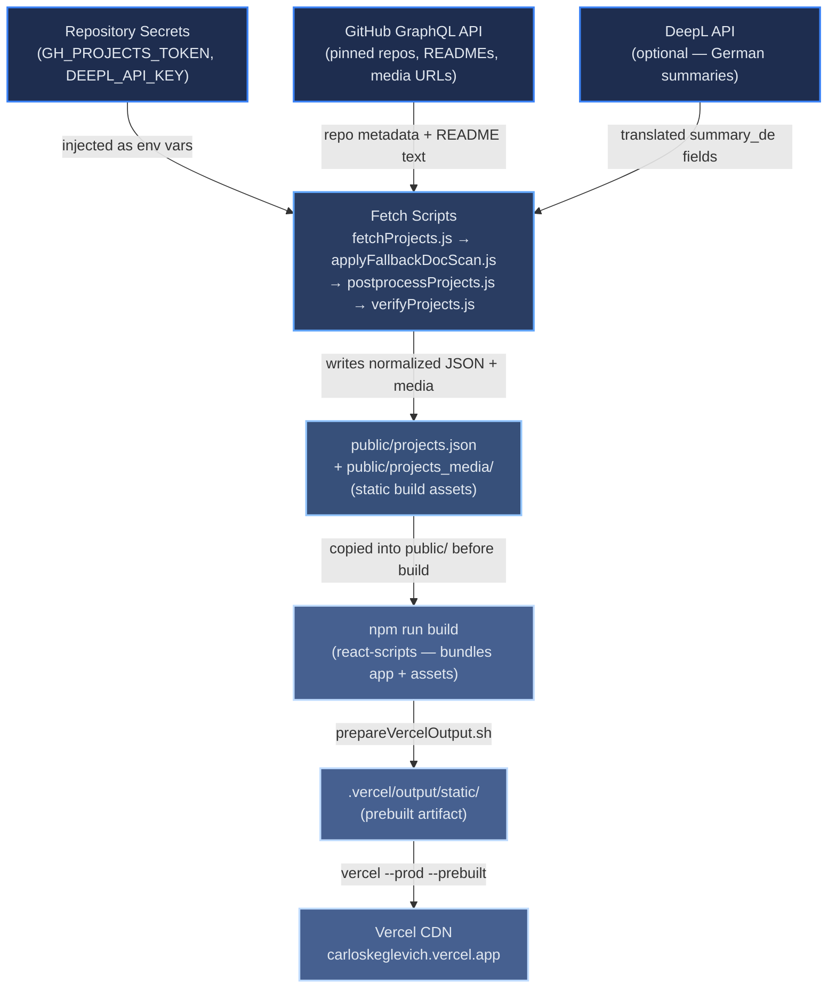
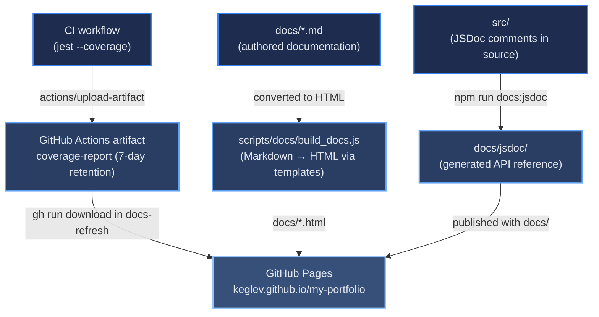

# Deployment Data Flow

[← Documentation root](../index.md)

This document shows how data moves through the deployment system — from external APIs and repository secrets through build-time scripts to the final deployment targets on Vercel and GitHub Pages. For configuration details (environment variables, step-by-step commands), see [DEPLOY.md](../DEPLOY.md). For the CI/CD workflow trigger chain, see [architecture/ci-cd-pipeline.md](../architecture/ci-cd-pipeline.md).

## Table of Contents

- [Configuration Inputs](#configuration-inputs)
- [Build-Time Project Data Flow](#build-time-project-data-flow)
- [Documentation and Coverage Flow](#documentation-and-coverage-flow)
- [Artifact Summary](#artifact-summary)
- [References](#references)

## Configuration Inputs

Before any data can flow through the build pipeline, three categories of external input must be available as environment variables in the GitHub Actions runner.

| Input | Provided by | Consumed by | Required |
|-------|------------|-------------|----------|
| `GH_PROJECTS_TOKEN` | GitHub repository secret | `scripts/fetchProjects.js` — authenticates the GraphQL API call | Yes |
| `DEEPL_API_KEY` / `DEEPL_SECRET` | GitHub repository secret | `scripts/fetchProjects.js` — translates project summaries to German | No |
| `VERCEL_TOKEN`, `VERCEL_ORG_ID`, `VERCEL_PROJECT_ID` | GitHub repository secrets | Vercel CLI deploy step | Yes |
| `GITHUB_TOKEN` | Automatically injected by Actions | `gh` CLI calls in all three workflows | Yes (automatic) |
| `DEBUG_FETCH` | Optional manual env var | `scripts/fetchProjects.js` — emits extra debug output | No |

## Build-Time Project Data Flow

The diagram below shows how project data moves from the GitHub GraphQL API and optional DeepL translation service through the fetch scripts to the final Vercel deployment.

The four fetch scripts run sequentially and form a single logical stage:

1. `fetchProjects.js` — calls the GitHub GraphQL API, downloads README files and project media, optionally calls DeepL for German summaries, and writes the raw `public/projects.json`.
2. `applyFallbackDocScan.js` — scans READMEs for documentation links when the primary fetch yields none, filling gaps before normalization.
3. `postprocessProjects.js` — normalizes all links in `projects.json` for offline use (converts raw GitHub URLs to blob URLs).
4. `verifyProjects.js` — validates the final `projects.json` against the expected schema; the build fails if validation does not pass.

## Documentation and Coverage Flow

The diagram below shows how documentation sources and the test coverage report flow into GitHub Pages independently of the Vercel deployment.

The `docs-refresh.yml` workflow is responsible for the entire right side of this diagram. It is triggered after a successful Vercel deployment (dispatched by `build-and-fetch.yml`) and also directly on pushes to `docs/**` or `scripts/docs/**`, which lets small documentation edits publish without running the full pipeline.

## Artifact Summary

The table below lists every intermediate and final artifact produced by the deployment system, where it originates, and where it lands.

| Artifact | Produced by | Stage | Destination |
|----------|------------|-------|-------------|
| `public/projects.json` | `scripts/fetchProjects.js` | Build-time | Copied into `.vercel/output/static/` |
| `public/projects_media/` | `scripts/fetchProjects.js` | Build-time | Copied into `.vercel/output/static/projects_media/` |
| `build/` | `npm run build` (CRA) | Build-time | Merged into `.vercel/output/static/` |
| `.vercel/output/static/` | `scripts/prepareVercelOutput.sh` | Pre-deploy | Deployed to Vercel CDN |
| `coverage/` | Jest (`--coverage` flag in CI) | CI | Uploaded as `coverage-report` artifact; later copied to `docs/coverage/` |
| `docs/jsdoc/` | `npm run docs:jsdoc` (JSDoc) | Docs-refresh | Published to `gh-pages` branch |
| `docs/*.html` | `scripts/docs/build_docs.js` | Docs-refresh | Published to `gh-pages` branch |
| `docs/templates/styles.css` | `scripts/docs/build_docs.js` (copied from `scripts/docs/templates/`) | Docs-refresh | Published to `gh-pages` branch alongside `docs/*.html` |

## References

- [DEPLOY.md](../DEPLOY.md) — environment variables, manual deployment commands, and security notes
- [architecture/ci-cd-pipeline.md](../architecture/ci-cd-pipeline.md) — workflow trigger chain and step details
- [REFRESH.md](../REFRESH.md) — how to regenerate `projects.json` and trigger a redeployment
