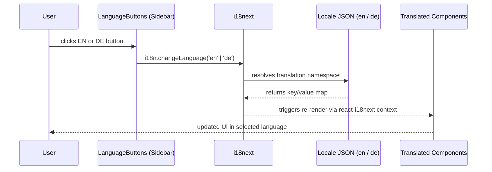
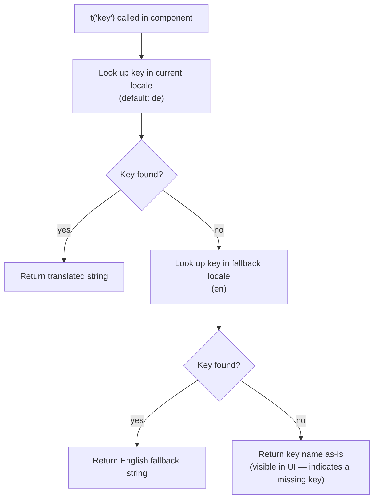

# Crosscutting Concepts: i18n & Theming

[← Architecture index](index.md)

Language switching (i18next/react-i18next) and the light/dark theme system are two crosscutting concepts that touch nearly every component, which is why they're documented together rather than under Building Blocks.

## Table of Contents

- [Language Switch Sequence](#language-switch-sequence)
- [Namespaces and Keys](#namespaces-and-keys)
- [Key Structure](#key-structure)
- [Translation Resolution](#translation-resolution)
- [Configuration Details](#configuration-details)
- [Adding a Translation Key](#adding-a-translation-key)
- [Adding a New Language](#adding-a-new-language)
- [Special Cases](#special-cases)
- [Style Layers](#style-layers)
- [Design Tokens](#design-tokens)
- [styled-components Layer](#styled-components-layer)
- [CSS Files Per Component](#css-files-per-component)
- [Responsive Design](#responsive-design)
- [Conventions](#conventions)
- [References](#references)

## Language Switch Sequence

The sequence below traces what happens from the moment the user clicks a language button to the point where the updated UI renders.

Because both locale files are imported directly at i18next init and bundled at build time, there is no network request on language switch. The transition is synchronous.

## Namespaces and Keys

The app uses a single i18next namespace — `translation`, the default — containing all translatable strings.

## Key Structure

All keys live in a single `translation` namespace — i18next's default — so no namespace prefix is needed when calling `t()`. Access nested keys in components with dot notation: `t('aboutSection.heading')`.

## Translation Resolution

When a component calls `t('key')`, i18next resolves the value in this order.

## Configuration Details

All components access translations via the `useTranslation()` hook: `const { t } = useTranslation()`.

| Setting | Value | Reason |
|---------|-------|--------|
| `lng` | `'de'` | Portfolio targets a German-speaking job market; German is the default experience |
| `fallbackLng` | `'en'` | Falls back to English if a key is missing from the German locale file |
| `interpolation.escapeValue` | `false` | React already escapes interpolated values; disabling prevents double-escaping |
| `compatibilityJSON` | `'v3'` | Matches the plural-key format used in the locale JSON files |
| Namespace | `translation` (default) | A single namespace is sufficient; splitting would add configuration overhead without benefit |

## Adding a Translation Key

Follow these steps in order to add a new translatable string.

1. Add the key to the English locale file with the English value.
2. Add the same key — with identical nesting — to the German locale file with the German value.
3. Access the key in the component: `const { t } = useTranslation(); t('your.new.key')`.
4. Run `npm start` and switch between EN and DE to verify both values render correctly.

If the German translation is not yet available, add the key with an empty string `""`. i18next will display the English fallback until the German value is supplied.

## Adding a New Language

Follow these steps in order to introduce a third locale.

1. Create a new locale JSON file with the same top-level key structure as the English file.
2. Import the file and register it in the i18next init call's `resources` map.
3. Add a toggle button for the new language to the sidebar's language switch group.
4. Add the new language's button label to every existing locale file.

## Special Cases

### HTML content in legal keys

Legal-section content (Impressum/Datenschutz) is authored as raw HTML strings in the locale files and rendered with `dangerouslySetInnerHTML`. This is safe only because the strings are authored by the developer in the locale files, not derived from user input. Do not use this pattern for any user-provided content.

### German project summaries

Project records in `src/data/projects.config.js` carry both `summaryEn` and `summaryDe` fields, hand-curated alongside the rest of the project entry. `ProjectSummary` selects the field matching the active locale.

## Style Layers

Three files provide the foundation on which all component styles build.

| File | Purpose |
|------|---------|
| `src/index.css` | CSS custom properties (design tokens) and the CRA default base reset |
| `src/styles/GlobalStyles.js` | styled-components global reset: universal box-sizing, Montserrat font, dark background, base line-height |
| `src/App.css` | Two-column layout shell (`.container`, `.main-content`, `.section`) |

`GlobalStyles` is injected by the root `App` component via `<GlobalStyles />` and is always present. `index.css` is imported by `src/index.js` and makes the CSS custom properties available to every downstream stylesheet.

## Design Tokens

All colour, spacing, shadow, and transition values are defined in `src/index.css` under `:root`. Referencing tokens instead of raw values means a colour or spacing change propagates across the entire UI from one edit.

| Token | Value | Usage |
|-------|-------|-------|
| `--color-bg` | `#0a192f` | Page and section backgrounds |
| `--color-bg-card` | `#17335f` | Project and legal card backgrounds |
| `--color-bg-card-hover` | `#234a80` | Card hover state |
| `--color-bg-tag` | `#2b3a59` | Technology tag pill backgrounds |
| `--color-bg-subtle` | `#0f2238` | Image placeholder background |
| `--color-accent` | `#6cb6ff` | Headings, links, borders, icon highlights |
| `--color-text` | `#ccd6f6` | Primary body text |
| `--color-text-muted` | `#8892b0` | Secondary text (job title, captions) |
| `--shadow-accent` | `rgba(108,182,255,0.45)` | Card hover drop shadow |
| `--shadow-accent-hover` | `rgba(108,182,255,0.6)` | Image hover drop shadow |
| `--radius-card` | `8px` | Card and image border radius |
| `--transition-card` | `background-color 0.3s ease, box-shadow 0.3s ease` | Shared card hover transition |
| `--padding-section` | `5rem 2rem` | Uniform section padding |
| `--padding-card` | `1.5rem` | Uniform card internal padding |

## styled-components Layer

`src/components/Sidebar/SidebarStyles.js` defines all sidebar styled components. `styled-components` was chosen here because the sidebar has complex responsive behaviour (fixed-to-static collapse at 768px), multiple interactive states (hover transforms, active link slides), and tightly coupled dynamic logic that benefits from co-location with the component file.

| Exported component | Role |
|-------------------|------|
| `SidebarContainer` | Fixed full-height column on desktop; collapses to a static top block on mobile |
| `NameTitle` | Name and job title block; uses `clamp()` to keep the name on one line within the fixed sidebar width |
| `StyledLink` | `react-scroll` Link; slides right 10px and switches to accent colour on hover/active |
| `Menu` | Vertical nav link column; hidden via `display: none` on mobile |
| `SocialLinksWrapper` | Centering wrapper for the social icon row |
| `SocialLinks` | Social icon row with scale-and-colour hover effect |
| `FooterMessage` | Footer text and legal navigation button area |
| `LanguageWrapper` | Language toggle button group with ghost-button styling and lift-on-hover transition |
| `LegalButton` | Invisible-border `<button>` used for the Impressum and Datenschutz footer links |
| `CVDownloadWrapper` | Centering wrapper for the CV download link |
| `CVDownloadLink` | Anchor styled identically to the language buttons so both actions feel like peers |

## CSS Files Per Component

Section components each have their own `.css` file co-located in the component directory. All CSS files reference the design tokens from `src/index.css`.

| File | Covers |
|------|--------|
| `src/App.css` | Two-column flex layout shell, section scroll margins |
| `src/components/About/About.css` | Profile/bio flex layout, tech-stack grid, profile image hover and hue-rotate effect |

## Responsive Design

The single layout breakpoint is `max-width: 768px`. Below it the following changes take effect.

| Element | Desktop | Mobile |
|---------|---------|--------|
| `div.container` | `flex-direction: row` | `flex-direction: column` |
| `SidebarContainer` | `position: fixed`, `width: 350px`, `height: 100vh` | `position: relative`, `width: 100%`, `height: auto` |
| `Menu` (nav links) | visible | `display: none` |
| `.main-content` | `margin-left: 350px` | `margin-left: 0` |
| `.section` padding | `2rem 0` with `--padding-section` inside | reduced |

## Conventions

- Prefer design tokens over raw hex or pixel values. If a new colour or spacing value is needed, add it to `:root` in `src/index.css` first.
- Use `styled-components` for components with multiple visual states or dynamic props tightly coupled to component logic. Use plain CSS files for simpler section components.
- Group CSS rules by concern with banner comments: `/* ─── Layout ─── */`, `/* ─── Responsive ─── */`, `/* ─── Skeleton Loader ─── */`.
- Write class names in kebab-case: `.project-card`, `.project-content`, `.tech-box`.
- Transition durations follow `--transition-card` (300ms ease) unless a component requires a distinct rhythm — for example, the sidebar hover uses a shorter 150ms ease.

## References

- [i18next documentation](https://www.i18next.com)
- [react-i18next documentation](https://react.i18next.com)
- [i18next configuration options](https://www.i18next.com/overview/configuration-options)
- [styled-components documentation](https://styled-components.com/docs)
- [MDN CSS custom properties](https://developer.mozilla.org/en-US/docs/Web/CSS/Using_CSS_custom_properties)
- [architecture/05-building-blocks.md](05-building-blocks.md) — which components own which style files
