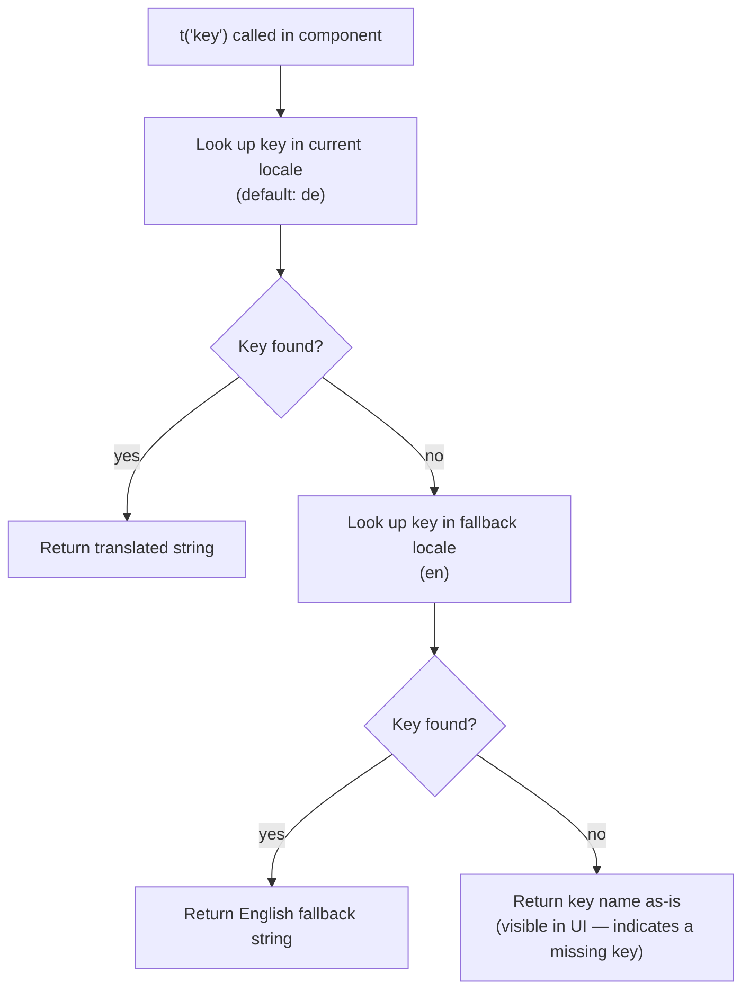

# Localization Guide

[← Architecture index](../architecture/index.md)

The portfolio supports English and German via i18next and react-i18next. This guide covers the key structure, how translations are resolved at runtime, and the steps to add a new key or a new language. For the runtime sequence of a language switch, see [architecture/i18n-flow.md](../architecture/i18n-flow.md).

## Table of Contents

- [Key Structure](#key-structure)
- [Translation Resolution](#translation-resolution)
- [Adding a Translation Key](#adding-a-translation-key)
- [Adding a New Language](#adding-a-new-language)
- [Special Cases](#special-cases)
- [References](#references)

## Key Structure

Both locale files share the same top-level structure. All keys live in a single `translation` namespace — i18next's default — so no namespace prefix is needed when calling `t()`.

```json
{
  "name":              "portfolio owner's name",
  "title":             "job title shown in the sidebar",
  "about":             "nav link label",
  "education":         "nav link label",
  "projects":          "section heading",
  "repoDocs":          "section heading",
  "footerMessage":     "sidebar footer tagline",
  "impressumLink":     "Impressum button label",
  "datenschutzLink":   "Privacy Policy button label",
  "viewOnGithub":      "project card GitHub link label",
  "viewDocs":          "repo docs link label",
  "urlLabel":          "live application link label",
  "noRepoDocs":        "empty-state message in RepoDocs",
  "translationMissing":"inline missing-translation indicator",

  "language": {
    "english": "EN button label",
    "german":  "DE button label"
  },
  "experience": {
    "label":          "nav link label",
    "jobExperiences": "section heading"
  },
  "aboutSection": {
    "heading":      "section h2",
    "description1": "first bio paragraph",
    "description2": "second bio paragraph",
    "description3": "third bio paragraph"
  },
  "educationSection": {
    "heading": "section h2",
    "entry1":  { "title": "...", "institution": "...", "note": "..." },
    "entry2":  { "title": "...", "institution": "...", "note": "..." },
    "entry3":  { "title": "...", "institution": "...", "note": "..." },
    "entry4":  { "title": "...", "institution": "...", "note": "..." }
  },
  "experienceSection": {
    "experience1": { "title": "...", "date": "...", "summary": "..." },
    "experience2": { "title": "...", "date": "...", "summary": "..." },
    "experience3": { "title": "...", "date": "...", "summary": "..." },
    "experience4": { "title": "...", "date": "...", "summary": "..." },
    "experience5": { "title": "...", "date": "...", "summary": "..." },
    "experience6": { "title": "...", "date": "...", "summary": "..." }
  },
  "legal": {
    "impressumHeading":   "Impressum section h2",
    "impressumContent":   "HTML string rendered with dangerouslySetInnerHTML",
    "datenschutzHeading": "Privacy Policy section h2",
    "datenschutzContent": "HTML string rendered with dangerouslySetInnerHTML"
  }
}
```

Access nested keys in components with dot notation: `t('aboutSection.heading')`, `t('experience.jobExperiences')`.

## Translation Resolution

When a component calls `t('key')`, i18next resolves the value in this order.



The `translationMissing` key is used by `ProjectSummary` to append an inline italic indicator when a German project summary has not yet been provided. It is a UI label, not part of i18next's automatic fallback chain.

## Adding a Translation Key

Follow these steps in order to add a new translatable string.

1. Add the key to `src/locales/en.json` with the English value.
2. Add the same key — with identical nesting — to `src/locales/de.json` with the German value.
3. Access the key in the component: `const { t } = useTranslation(); t('your.new.key')`.
4. Run `npm start` and switch between EN and DE to verify both values render correctly.

If the German translation is not yet available, add the key to `de.json` with an empty string `""`. i18next will display the English fallback until the German value is supplied.

## Adding a New Language

Follow these steps in order to introduce a third locale.

1. Create `src/locales/<code>.json` (e.g. `fr.json`) with the same top-level key structure as `en.json`.
2. Import the file and register it in `src/i18n.js`:
   ```js
   import frTranslation from './locales/fr.json';

   resources: {
     en: { translation: enTranslation },
     de: { translation: deTranslation },
     fr: { translation: frTranslation },
   }
   ```
3. Add a toggle button to the `LanguageWrapper` in `src/components/Sidebar/SidebarMenu.js`.
4. Add the new language's button label to the `language` key in every existing locale file.
5. If a CV PDF is available in the new locale, add its filename to the `cvFile` conditional in `SidebarMenu.js`.

## Special Cases

### HTML content in legal keys

`legal.impressumContent` and `legal.datenschutzContent` contain raw HTML strings (paragraph tags, heading tags, anchor elements). The `Legal` component renders them with `dangerouslySetInnerHTML`. This is safe only because the strings are authored by the developer in the locale files, not derived from user input. Do not use this pattern for any user-provided content.

### German project summaries

Project records in `public/projects.json` may include a `summary_de` field populated by the DeepL API during the build-time fetch step. `ProjectSummary` checks this field when the active locale is `'de'`. These machine-translated summaries are separate from the main i18n locale files — they are project data, not UI strings, and are not managed via `t()`.

## References

- [i18next documentation](https://www.i18next.com)
- [react-i18next useTranslation hook](https://react.i18next.com/latest/usetranslation-hook)
- [i18next configuration options](https://www.i18next.com/overview/configuration-options)
- [architecture/i18n-flow.md](../architecture/i18n-flow.md) — runtime language-switch sequence diagram
