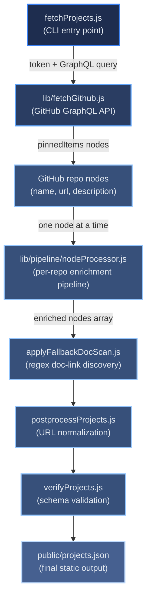

# Scripts Overview

[← Scripts index](index.md)

The `scripts/` directory contains the build-time data pipeline that populates the portfolio with live project data. Seven root-level scripts act as CLI entry points or validation tools; all heavy logic lives in `scripts/lib/` and its subdirectories. The `scripts/docs/` subdirectory holds the documentation build tooling used by the `docs-refresh` workflow.

## Table of Contents

- [Top-Level Pipeline Flow](#top-level-pipeline-flow)
- [Root-Level Scripts](#root-level-scripts)
- [Documentation Generation Scripts](#documentation-generation-scripts)
- [Processing Pipeline](#processing-pipeline)
- [GitHub API](#github-api)
- [README Processing](#readme-processing)
- [Documentation Extraction](#documentation-extraction)
- [Media Handling](#media-handling)
- [Translation](#translation)
- [Output and Normalization](#output-and-normalization)
- [README Fetching and Summary Extraction](#readme-fetching-and-summary-extraction)
- [Utilities](#utilities)
- [References](#references)

## Top-Level Pipeline Flow

The diagram below shows how the root-level scripts orchestrate the full data pipeline. `nodeProcessor.js` is shown as a single stage; its internal three-stage design is described under [Processing Pipeline](#processing-pipeline).

## Root-Level Scripts

These scripts are executed directly by `npm run` commands or GitHub Actions workflow steps.

| Script | Purpose | Key inputs | Key outputs |
|--------|---------|-----------|------------|
| `fetchProjects.js` | CLI entry point; orchestrates the entire project-fetch pipeline | `GH_PROJECTS_TOKEN`, `DEEPL_API_KEY` env vars | `public/projects.json`, `public/projects_media/` |
| `postprocessProjects.js` | Upgrades raw `githubusercontent.com` URLs to GitHub Pages equivalents; splits compound technology tokens | `public/projects.json` | `public/projects.json` (updated in place) |
| `applyFallbackDocScan.js` | Regex scan of README text for doc-like links on nodes that have no structured `repoDocs` yet | `public/projects.json` | `public/projects.json` (adds missing doc links) |
| `verifyProjects.js` | Reads `projects.json` and logs repo names with their detected doc links; exits 0 if the file is missing | `public/projects.json` | Console summary; non-zero exit on invalid content |
| `audit-check.js` | Runs `npm audit --json`; fails the process if any high or critical vulnerabilities are found | npm audit JSON output | Exit code 0 (pass) / 1 (vulns found) / 2 (audit failed) |
| `run-eslint-dev.js` | Runs ESLint with `NODE_ENV=development` so CRA's React-specific rules activate; fails on any warning | `src/` directory | ESLint report via stylish formatter |
| `prepareVercelOutput.sh` | Assembles the Vercel Output API v3 artifact: resets `.vercel/output/`, copies `build/` + `projects.json` + media, writes `config.json` | `build/`, `public/projects.json` | `.vercel/output/static/` |

## Documentation Generation Scripts

Scripts in `scripts/docs/` are called by the `docs-refresh` GitHub Actions workflow to transform Markdown documentation into deployable HTML.

| Script | Purpose |
|--------|---------|
| `scripts/docs/build_docs.js` | Reads HTML templates from `scripts/docs/templates/`; converts every `docs/*.md` to `docs/*.html` using `page.html`; generates a sidebar TOC from h2/h3 headings; wraps Mermaid code blocks in `.mermaid-wrapper` divs; copies `hub.html` → `docs/index.html` and `styles.css` → `docs/templates/styles.css` |
| `scripts/docs/build_mermaid.js` | Scans the generated HTML files for Mermaid wrapper blocks and pre-renders them to inline SVG using `@mermaid-js/mermaid-cli` (`mmdc`); exits cleanly when `mmdc` is not installed so that client-side CDN rendering acts as the fallback |

## Processing Pipeline

`scripts/lib/pipeline/nodeProcessor.js` is the central coordinator. It runs a three-stage pipeline for each repo node returned by the GitHub API.

| Stage | Function | Responsibility |
|-------|----------|---------------|
| Doc stage | `runDocStage(node, svc)` | Fetches the README, downloads media, extracts technology tags, extracts documentation links, runs doc heuristics backfill, extracts the project summary |
| Translation stage | `runTranslationStage(node, svc)` | Calls `translatorFacade.translateNode` to batch-translate all UI strings (summary, doc titles, descriptions) to German via DeepL |
| Persistence stage | `runPersistenceStage(node, svc)` | Saves per-repo `meta.json`, normalizes all relative URLs to absolute, upgrades raw GitHub URLs to GitHub Pages equivalents where available, checks media download status |

The module accepts a `services` object (`getAxios`, `parseReadme`, `translateWithCache`, `shouldTranslateUI`, `DEBUG_FETCH`) so all external dependencies can be injected during tests without network calls.

## GitHub API

| File | Purpose |
|------|---------|
| `lib/fetchGithub.js` | Runs GitHub GraphQL queries; performs a lightweight auth test before the real query to surface token errors early; extracts repo nodes from the `pinnedItems` or `repositories` response shape |
| `lib/graphql/pinnedGraphql.js` | Defines the GraphQL query that fetches the first 12 pinned repositories (name, description, URL) for a given GitHub login |

## README Processing

`scripts/lib/parseReadme/` parses a repository's README markdown into an AST and extracts structured data from it.

| File | Purpose |
|------|---------|
| `parser.js` | Converts markdown text to an AST using `unified`/`remark`; falls back to a synchronous minimal AST builder when those packages are absent |
| `helpers.js` | AST traversal utilities: flatten node text, extract plain text from list items, find the first link in a paragraph or list node |
| `normalize.js` | `normalizeTitle` strips markdown, URLs, and emoji then truncates to 120 chars; `normalizeSummary` does the same for summaries at 400 chars |
| `techs.js` | Finds the "Technologies" or "Tech Stack" heading in the AST and extracts technology tokens, preferring bold-formatted tokens over comma-separated lists |
| `images.js` | Selects the best representative image from the AST; priority order: screenshot/gallery heading → explicit `project-image.png` path → raster images → any image; skips CI badge URLs |
| `docs.js` | Extracts documentation links from named headings (`API Documentation`, `Architecture Overview`) in the AST; falls back to a raw-text regex scan |
| `extractors.js` | Re-exports `images`, `techs`, `docs`, and `helpers` as the public surface of the `parseReadme` module |

## Documentation Extraction

`scripts/lib/docs/` extracts structured documentation metadata from each project's README.

| File | Purpose |
|------|---------|
| `extractReadmeDocs.js` | Main orchestrator; calls all four extractors below and returns `{ architectureOverview, apiDocumentation, testing, productionUrl }`; returns a placeholder object when no docs are found so the UI always has a fallback |
| `extractArchitecture.js` | Finds the "Architecture Overview" heading then looks for an "Index" link beneath it; scans AST nodes first, falls back to text search |
| `extractApiDocs.js` | Multi-stage search for "Complete API" links: AST paragraphs/lists → line-by-line text scan → any API link fallback |
| `extractTesting.js` | Finds "Test Coverage" links anywhere in the README and returns them as a `{ coverage: [...] }` array |
| `extractProductionUrl.js` | Finds a "Production URL" link in paragraphs or lists; falls back to raw text search |
| `docsHeuristics.js` | Post-processing: `backfillDocsFromText` runs a regex fallback for doc links; `postProcessDocsLinkCandidates` replaces issue/PR links with better alternatives from `repoDocs` |
| `translateDocs.js` | Batch-translates doc field titles and descriptions to German using the provided translate function; adds `_de`-suffixed fields alongside originals |
| `urlResolver.js` | `toRawGithub` converts relative README paths to absolute `raw.githubusercontent.com` URLs; routes through GitHub Pages when no auth token is present to avoid CORS issues |

## Media Handling

`scripts/lib/media/` downloads and caches project images fetched during the README processing stage.

| File | Purpose |
|------|---------|
| `mediaDownloader.js` | Downloads an image URL to `public/projects_media/<repoName>/`; enforces a 2 MB size cap; uses an MD5 hash as the filename for deterministic caching; validates `Content-Type: image/*`; skips files already on disk |
| `mediaHelper.js` | High-level media pipeline: probes for an explicit `project-image.png` first, then falls back to the AST-derived image candidate, then the first markdown image; rewrites the README text to reference the local path after download |
| `persistence.js` | Saves per-repo `meta.json` tracking `readmeHash`, `imageSelection`, `primaryImage`, `summarySource`, and translation metadata so subsequent runs can skip unchanged repos |

## Translation

`scripts/lib/translation/` integrates with the DeepL API to provide German translations for project summaries and documentation titles.

| File | Purpose |
|------|---------|
| `translate.js` | Calls the DeepL API for a single string (≤ 300 chars); returns `{ text, status, raw?, error? }`; returns `status: 'no-key-or-text'` when no API key is present so the pipeline degrades gracefully |
| `translationOrchestrator.js` | Collects all translatable strings for a node into a single `Promise.all` batch to minimise API round-trips; uses parallel index arrays to map results back to their target node fields |
| `translatorFacade.js` | High-level entry point; calls the orchestrator and writes the translated values back onto the node |

## Output and Normalization

| File | Purpose |
|------|---------|
| `lib/output/writeProjects.js` | Pretty-prints the final enriched node array to `public/projects.json` |
| `lib/normalize/normalize.js` | `toRawGithub` converts relative paths to absolute `raw.githubusercontent.com` URLs; `normalizeRepoDocsLinks` applies this to all `repoDocs` link fields on a node |
| `lib/normalize/githubIoPreferer.js` | Probes each raw GitHub URL with an HTTP HEAD request; if the GitHub Pages equivalent responds with HTML and does not set `X-Frame-Options: DENY`, upgrades the URL so docs can be embedded in the portfolio |

## README Fetching and Summary Extraction

| File | Purpose |
|------|---------|
| `lib/readme/readmeHandler.js` | Full README processing entry point: fetches the README if absent, parses it to an AST, downloads media, extracts technologies, and extracts documentation links; mutates the node in place |
| `lib/readme/readmeFallback.js` | HTTP fallback that fetches `README.md` from `raw.githubusercontent.com` when the GraphQL response contains no README text; tries `main` then `master` branches with an 8-second timeout |
| `lib/summary/summaryExtractor.js` | Extracts a one-line project summary in priority order: named section heading (About, Overview, Description) → first paragraph → raw truncation at 160 chars; records the source strategy in `summarySource` |

## Utilities

| File | Purpose |
|------|---------|
| `lib/axiosLoader.js` | Lazily loads `axios` with a deferred `require()` to avoid ESM entry-point issues in test runners; returns `null` when `axios` is not installed so callers can skip network steps gracefully |
| `prepareVercelOutput.sh` | Bash script that idempotently resets `.vercel/output/`, copies the CRA `build/` output and the pre-generated `projects.json` and media into `.vercel/output/static/`, and writes the Vercel Output API v3 `config.json` |

## References

- [REFRESH.md](../REFRESH.md) — when and how to re-run the fetch pipeline
- [deploy/data-flow.md](../deploy/data-flow.md) — how script outputs flow to Vercel and GitHub Pages
- [architecture/ci-cd-pipeline.md](../architecture/ci-cd-pipeline.md) — which workflow step calls which script
